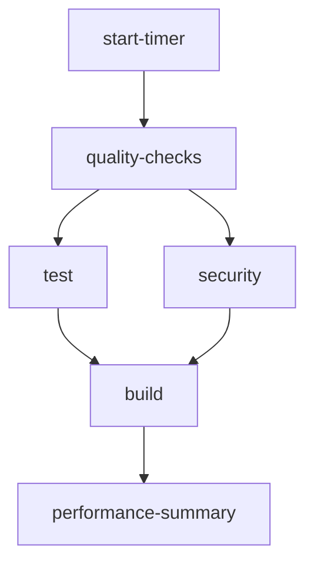

# CI/CD Pipeline Documentation

This directory contains documentation for the GitHub Actions CI/CD pipeline implementation.

## Overview

The FindConstructionStaffing project uses a comprehensive CI/CD pipeline with GitHub Actions for automated quality checks, testing, security scanning, and deployment to Vercel.

## Documentation Index

- **[setup.md](./setup.md)** - Environment setup and configuration guide
- **[performance.md](./performance.md)** - Performance monitoring and optimization
- **[troubleshooting.md](./troubleshooting.md)** - Common issues and solutions
- **[fix-summary.md](./fix-summary.md)** - Historical fixes and improvements

## Quick Start

### Prerequisites

- GitHub repository with Actions enabled
- Vercel account and project
- Supabase project
- Required secrets configured (see setup.md)

### Workflow Overview

The pipeline consists of several key workflows:

1. **CI Pipeline** (`.github/workflows/ci.yml`)
   - Code quality checks (ESLint, Prettier, TypeScript)
   - Unit and integration tests
   - Security scanning
   - Build verification

2. **Deployment** (`.github/workflows/deploy.yml`)
   - Preview deployments for PRs
   - Production deployments on merge to main
   - Automatic PR comments with deployment URLs

3. **Testing** (`.github/workflows/test-with-db.yml`)
   - Tests with real PostgreSQL database
   - Database seed verification

4. **Monitoring** (`.github/workflows/performance-monitor.yml`, `performance-dashboard.yml`)
   - Performance tracking
   - Automated dashboards

5. **Health Checks** (`.github/workflows/production-health-check.yml`)
   - Post-deployment validation
   - Automated rollback on failures

## Key Features

✅ **Automated Quality Checks**
- TypeScript strict mode verification
- ESLint with max warnings: 0
- Prettier formatting
- 85%+ test coverage requirement

✅ **Comprehensive Testing**
- 733+ tests across 66 test suites
- Unit, integration, and E2E tests
- Mock-free database testing option

✅ **Security**
- npm audit scanning (critical vulnerabilities only)
- Dependency vulnerability tracking
- Secrets management

✅ **Performance**
- Parallel job execution
- Dependency caching
- Build artifact reuse
- Average pipeline duration: 3-5 minutes

✅ **Deployment**
- Preview deployments for all PRs
- Production deployments on merge
- Automatic aliasing and DNS management
- Rate limit protection
- Health check verification
- Automatic rollback capability

## Workflow Status

Check the current status of all workflows:


## Configuration

### Required Secrets

See [setup.md](./setup.md) for detailed secret configuration.

```
VERCEL_TOKEN
VERCEL_ORG_ID
VERCEL_PROJECT_ID
NEXT_PUBLIC_SUPABASE_URL
NEXT_PUBLIC_SUPABASE_ANON_KEY
SUPABASE_SERVICE_ROLE_KEY
```

### Branch Protection Rules

The main branch is protected with:
- Required status checks (all CI jobs must pass)
- Required reviews (1 approver)
- No force pushes
- No deletions

See `.github/BRANCH_PROTECTION.md` for full configuration.

## Monitoring

### Performance Dashboard

A daily-updated performance dashboard tracks:
- Success rates
- Average duration
- Failure trends
- Resource usage

Access at: [Performance Dashboard](./performance.md)

### Alerts

The pipeline automatically:
- Comments on PRs with deployment URLs
- Creates issues for failed deployments (optional)
- Sends notifications for security vulnerabilities
- Tracks rate limits and usage

## Troubleshooting

See [troubleshooting.md](./troubleshooting.md) for common issues and solutions.

Quick links:
- [Tests failing in CI but passing locally](./troubleshooting.md#tests-failing-in-ci)
- [Deployment failures](./troubleshooting.md#deployment-failures)
- [Rate limit errors](./troubleshooting.md#rate-limits)
- [Environment variable issues](./troubleshooting.md#environment-variables)

## Development Workflow

### Making Changes

1. Create a feature branch from `main`
2. Make your changes
3. Push to trigger CI checks
4. Create PR when checks pass
5. Review and merge

### Local Testing

Before pushing:

```bash
# Run all quality checks
npm run lint
npm run type-check
npm run format:check

# Run tests
npm test

# Run tests with coverage
npm test -- --coverage
```

## Architecture

### Job Dependencies



### Caching Strategy

- **npm dependencies**: Cached by `package-lock.json` hash
- **TypeScript builds**: Cached by source file hashes
- **ESLint**: Cached by config and lock file
- **Jest**: Test results cached for faster reruns

## Performance Optimization

Current optimizations:
- Matrix strategy for parallel quality checks
- Conditional job execution
- Artifact reuse between jobs
- Dependency caching
- Concurrency groups to cancel outdated runs

See [performance.md](./performance.md) for detailed metrics and optimization guide.

## Future Improvements

See [docs/PR9-FOLLOWUP-ISSUES.md](../PR9-FOLLOWUP-ISSUES.md) for planned enhancements:
- Enhanced dependency caching (node_modules)
- Improved dashboard data population
- Security hardening (SHA-pinned actions)
- Additional performance optimizations

## Related Documentation

- [Production Runbook](../PRODUCTION_RUNBOOK.md)
- [Deployment Guide](../deployment/)
- [Vercel Configuration](../VERCEL_DEPLOYMENT.md)
- [Feature Specification](../features/006-cicd-pipeline.md)

## Support

For issues or questions:
1. Check [troubleshooting.md](./troubleshooting.md)
2. Review [PR9-FOLLOWUP-ISSUES.md](../PR9-FOLLOWUP-ISSUES.md)
3. Create a GitHub issue with the `ci-cd` label

---

**Last Updated**: 2025-12-11
**Version**: 1.0.0
**Maintainer**: Development Team
