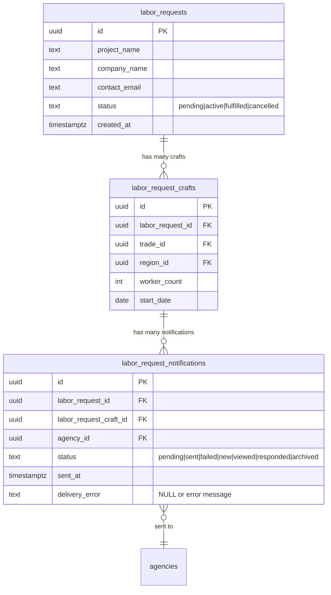

# Admin Dashboard for Labor Requests

## Overview

Create a comprehensive admin dashboard to provide full visibility into the labor request system. This dashboard will enable administrators to view all submitted labor requests, monitor notification delivery status, track agency match counts, identify email delivery errors, and manually manage request statuses.

**Feature**: feat/admin-labor-requests-dashboard

**Type**: Enhancement (New Feature)

**Complexity**: Moderate - Follows established admin patterns with multi-table joins

## Problem Statement / Motivation

Currently, administrators lack visibility into the labor request system (Phases 1-6). When labor requests are submitted:
- Companies submit requests via public form
- System creates notifications for matching agencies
- Emails are sent to notify agencies
- Agencies respond through their inbox

**What's Missing**: No centralized admin view to:
- Monitor all submitted requests
- Track which agencies were matched and notified
- Identify email delivery failures
- Manually update request statuses if needed
- Debug issues or answer company inquiries

**Why This Matters**: Without admin visibility, we can't:
- Support companies asking "Was my request processed?"
- Debug notification delivery issues
- Monitor system health
- Manually intervene when automation fails

## Proposed Solution

Build an admin dashboard at `/admin/labor-requests` following existing admin patterns. The dashboard will:

1. **Display All Labor Requests** in a sortable, filterable table
2. **Show Match/Notification Counts** for each request
3. **Monitor Email Delivery Status** with error tracking
4. **Enable Status Management** with manual status updates
5. **Provide Detail View** with full request info and notification list

### Architecture

```text
┌─────────────────────────────────────────────────────┐
│  app/(app)/admin/labor-requests/page.tsx            │
│  (Server Component - Auth Check)                    │
└────────────────┬────────────────────────────────────┘
                 │
                 ▼
┌─────────────────────────────────────────────────────┐
│  components/admin/LaborRequestsTable.tsx            │
│  (Client Component - Table UI)                      │
└────────────────┬────────────────────────────────────┘
                 │
                 ▼
┌─────────────────────────────────────────────────────┐
│  app/api/admin/labor-requests/route.ts              │
│  GET: List with pagination, filters                 │
│  - Join: labor_requests → labor_request_crafts      │
│           → labor_request_notifications             │
│  - Compute: match_count, notification_stats         │
└─────────────────────────────────────────────────────┘
                 │
                 ▼
┌─────────────────────────────────────────────────────┐
│  app/api/admin/labor-requests/[id]/status/route.ts  │
│  POST: Update request status (with audit trail)     │
└─────────────────────────────────────────────────────┘
```

### Database Relationships



## Technical Approach

### Authentication Pattern (2025 Security Update)

**CRITICAL**: As of 2025, middleware-only authentication is vulnerable (CVE-2025-29927). Use Data Access Layer (DAL) pattern:

```typescript
// app/(app)/admin/labor-requests/page.tsx
export default async function AdminLaborRequestsPage() {
  const supabase = await createClient();

  // 1. Authentication check
  const { data: { user }, error: authError } = await supabase.auth.getUser();
  if (!user || authError) {
    redirect('/login');
    return null;
  }

  // 2. Admin role verification
  const { data: profile } = await supabase
    .from('profiles')
    .select('role')
    .eq('id', user.id)
    .single();

  if (!profile || profile.role !== 'admin') {
    redirect('/');
    return null;
  }

  // 3. Render client table component
  return <LaborRequestsTable />;
}
```

**Reference**: `app/(app)/admin/claims/page.tsx:1-40` (identical pattern)

### API Endpoint Design

**File**: `app/api/admin/labor-requests/route.ts`

**Pattern**: Follow 7-step admin API pattern from `app/api/admin/claims/route.ts:84-241`

```typescript
export async function GET(request: NextRequest) {
  const supabase = createClient();
  const searchParams = request.nextUrl.searchParams;

  // Step 1: Authentication
  const { data: { user }, error: authError } = await supabase.auth.getUser();
  if (!user || authError) {
    return NextResponse.json({ error: 'UNAUTHORIZED' }, { status: 401 });
  }

  // Step 2: Admin role verification
  const { data: profile } = await supabase
    .from('profiles')
    .select('role')
    .eq('id', user.id)
    .single();

  if (!profile || profile.role !== 'admin') {
    return NextResponse.json({ error: 'FORBIDDEN' }, { status: 403 });
  }

  // Step 3: Parse query parameters
  const page = parseInt(searchParams.get('page') || '1');
  const limit = parseInt(searchParams.get('limit') || '25');
  const offset = (page - 1) * limit;
  const statusFilter = searchParams.get('status') || 'all';
  const searchQuery = searchParams.get('search') || '';

  // Step 4: Build query with joins
  let query = supabase
    .from('labor_requests')
    .select(`
      *,
      crafts:labor_request_crafts(
        id,
        trade:trades(id, name),
        region:regions(id, name, state_code),
        worker_count,
        start_date,
        notifications:labor_request_notifications(
          id,
          agency:agencies(id, agency_name, slug),
          status,
          sent_at,
          viewed_at,
          responded_at,
          delivery_error
        )
      )
    `, { count: 'exact' });

  // Apply filters
  if (statusFilter !== 'all') {
    query = query.eq('status', statusFilter);
  }

  if (searchQuery) {
    query = query.or(`project_name.ilike.%${searchQuery}%,company_name.ilike.%${searchQuery}%`);
  }

  // Pagination
  query = query
    .order('created_at', { ascending: false })
    .range(offset, offset + limit - 1);

  // Step 5: Execute query
  const { data, error, count } = await query;

  if (error) {
    console.error('[Admin Labor Requests API] Query error:', error);
    return NextResponse.json({ error: 'DATABASE_ERROR' }, { status: 500 });
  }

  // Step 6: Build pagination metadata
  const pagination = {
    total: count || 0,
    limit,
    offset,
    page,
    totalPages: Math.ceil((count || 0) / limit),
    hasMore: offset + limit < (count || 0),
  };

  // Step 7: Transform data to include computed fields
  const transformedData = data.map(request => ({
    ...request,
    match_count: request.crafts?.reduce((sum, craft) =>
      sum + (craft.notifications?.length || 0), 0) || 0,
    notification_stats: {
      sent: request.crafts?.reduce((sum, craft) =>
        sum + (craft.notifications?.filter(n => n.status === 'sent' || n.status === 'new').length || 0), 0) || 0,
      failed: request.crafts?.reduce((sum, craft) =>
        sum + (craft.notifications?.filter(n => n.status === 'failed').length || 0), 0) || 0,
      responded: request.crafts?.reduce((sum, craft) =>
        sum + (craft.notifications?.filter(n => n.status === 'responded').length || 0), 0) || 0,
    },
    has_delivery_errors: request.crafts?.some(craft =>
      craft.notifications?.some(n => n.delivery_error)) || false,
  }));

  return NextResponse.json({
    data: transformedData,
    pagination
  }, { status: 200 });
}
```

### Table Component Design

**File**: `components/admin/LaborRequestsTable.tsx`

**Pattern**: Follow ClaimsTable pattern from `components/admin/ClaimsTable.tsx:1-150`

**Features**:
- Client component with useState for data/loading/error states
- Search input (project name, company name)
- Status filter dropdown (all, pending, active, fulfilled, cancelled)
- Pagination controls (25 items per page)
- Loading skeletons during fetch
- Error state with retry button
- Detail modal for viewing full request + notifications

```typescript
'use client';

import { useState, useEffect } from 'react';
import { Card } from '@/components/ui/card';
import { Input } from '@/components/ui/input';
import { Select, SelectContent, SelectItem, SelectTrigger, SelectValue } from '@/components/ui/select';
import { Button } from '@/components/ui/button';
import { Badge } from '@/components/ui/badge';
import { Skeleton } from '@/components/ui/skeleton';
import { Search, Filter, AlertCircle, CheckCircle, XCircle } from 'lucide-react';
import { LaborRequestDetailModal } from './LaborRequestDetailModal';

interface LaborRequestWithStats {
  id: string;
  project_name: string;
  company_name: string;
  contact_email: string;
  status: string;
  created_at: string;
  match_count: number;
  notification_stats: {
    sent: number;
    failed: number;
    responded: number;
  };
  has_delivery_errors: boolean;
}

interface PaginationMetadata {
  total: number;
  limit: number;
  offset: number;
  page: number;
  totalPages: number;
  hasMore: boolean;
}

const REQUESTS_PER_PAGE = 25;

export function LaborRequestsTable() {
  const [requests, setRequests] = useState<LaborRequestWithStats[]>([]);
  const [isLoading, setIsLoading] = useState(true);
  const [error, setError] = useState<string | null>(null);
  const [searchQuery, setSearchQuery] = useState('');
  const [statusFilter, setStatusFilter] = useState<string>('all');
  const [currentPage, setCurrentPage] = useState(1);
  const [pagination, setPagination] = useState<PaginationMetadata>({
    total: 0,
    limit: REQUESTS_PER_PAGE,
    offset: 0,
    hasMore: false,
    page: 1,
    totalPages: 0,
  });
  const [selectedRequestId, setSelectedRequestId] = useState<string | null>(null);

  useEffect(() => {
    fetchRequests();
  }, [currentPage, statusFilter]);

  const fetchRequests = async () => {
    setIsLoading(true);
    setError(null);

    try {
      const params = new URLSearchParams({
        page: currentPage.toString(),
        limit: REQUESTS_PER_PAGE.toString(),
      });

      if (statusFilter !== 'all') {
        params.append('status', statusFilter);
      }

      if (searchQuery) {
        params.append('search', searchQuery);
      }

      const response = await fetch(`/api/admin/labor-requests?${params.toString()}`);

      if (!response.ok) {
        throw new Error('Failed to fetch labor requests');
      }

      const data = await response.json();
      setRequests(data.data);
      setPagination(data.pagination);
    } catch (err) {
      setError(err instanceof Error ? err.message : 'Unknown error');
    } finally {
      setIsLoading(false);
    }
  };

  const handleSearch = () => {
    setCurrentPage(1);
    fetchRequests();
  };

  const getStatusBadge = (status: string) => {
    const variants: Record<string, 'default' | 'secondary' | 'destructive' | 'outline'> = {
      pending: 'secondary',
      active: 'default',
      fulfilled: 'outline',
      cancelled: 'destructive',
    };

    return (
      <Badge variant={variants[status] || 'default'}>
        {status.charAt(0).toUpperCase() + status.slice(1)}
      </Badge>
    );
  };

  if (isLoading && requests.length === 0) {
    return (
      <div className="space-y-4">
        <Skeleton className="h-12 w-full" />
        <Skeleton className="h-64 w-full" />
      </div>
    );
  }

  if (error) {
    return (
      <Card className="p-6 border-red-200 bg-red-50">
        <div className="flex items-center gap-2 text-red-800">
          <AlertCircle className="h-5 w-5" />
          <p>Error: {error}</p>
        </div>
        <Button onClick={fetchRequests} variant="outline" className="mt-4">
          Retry
        </Button>
      </Card>
    );
  }

  return (
    <div className="space-y-6">
      {/* Header with Stats */}
      <div className="flex items-center justify-between">
        <div>
          <h2 className="text-2xl font-bold">Labor Requests</h2>
          <p className="text-gray-600 mt-1">
            {pagination.total} total requests
          </p>
        </div>
      </div>

      {/* Filters */}
      <Card className="p-4">
        <div className="flex flex-col md:flex-row gap-4">
          <div className="flex-1">
            <div className="relative">
              <Search className="absolute left-3 top-1/2 transform -translate-y-1/2 h-4 w-4 text-gray-400" />
              <Input
                type="text"
                placeholder="Search by project or company name..."
                value={searchQuery}
                onChange={(e) => setSearchQuery(e.target.value)}
                onKeyDown={(e) => e.key === 'Enter' && handleSearch()}
                className="pl-10"
              />
            </div>
          </div>

          <div className="w-full md:w-48">
            <Select value={statusFilter} onValueChange={setStatusFilter}>
              <SelectTrigger>
                <Filter className="h-4 w-4 mr-2" />
                <SelectValue placeholder="Status" />
              </SelectTrigger>
              <SelectContent>
                <SelectItem value="all">All Status</SelectItem>
                <SelectItem value="pending">Pending</SelectItem>
                <SelectItem value="active">Active</SelectItem>
                <SelectItem value="fulfilled">Fulfilled</SelectItem>
                <SelectItem value="cancelled">Cancelled</SelectItem>
              </SelectContent>
            </Select>
          </div>

          <Button onClick={handleSearch}>Search</Button>
        </div>
      </Card>

      {/* Table */}
      <div className="rounded-md border">
        <table className="w-full">
          <thead className="bg-gray-50 border-b">
            <tr>
              <th className="px-4 py-3 text-left text-xs font-medium text-gray-500 uppercase">Project</th>
              <th className="px-4 py-3 text-left text-xs font-medium text-gray-500 uppercase">Company</th>
              <th className="px-4 py-3 text-left text-xs font-medium text-gray-500 uppercase">Status</th>
              <th className="px-4 py-3 text-left text-xs font-medium text-gray-500 uppercase">Matches</th>
              <th className="px-4 py-3 text-left text-xs font-medium text-gray-500 uppercase">Notifications</th>
              <th className="px-4 py-3 text-left text-xs font-medium text-gray-500 uppercase">Created</th>
              <th className="px-4 py-3 text-left text-xs font-medium text-gray-500 uppercase">Actions</th>
            </tr>
          </thead>
          <tbody className="divide-y">
            {requests.map((request) => (
              <tr key={request.id} className="hover:bg-gray-50">
                <td className="px-4 py-3 text-sm font-medium">{request.project_name}</td>
                <td className="px-4 py-3 text-sm">{request.company_name}</td>
                <td className="px-4 py-3">{getStatusBadge(request.status)}</td>
                <td className="px-4 py-3 text-sm">{request.match_count} agencies</td>
                <td className="px-4 py-3">
                  <div className="flex items-center gap-2 text-sm">
                    <span className="flex items-center gap-1">
                      <CheckCircle className="h-4 w-4 text-green-600" />
                      {request.notification_stats.sent}
                    </span>
                    {request.notification_stats.failed > 0 && (
                      <span className="flex items-center gap-1">
                        <XCircle className="h-4 w-4 text-red-600" />
                        {request.notification_stats.failed}
                      </span>
                    )}
                    {request.has_delivery_errors && (
                      <AlertCircle className="h-4 w-4 text-orange-600" />
                    )}
                  </div>
                </td>
                <td className="px-4 py-3 text-sm">
                  {new Date(request.created_at).toLocaleDateString()}
                </td>
                <td className="px-4 py-3">
                  <Button
                    variant="outline"
                    size="sm"
                    onClick={() => setSelectedRequestId(request.id)}
                  >
                    View Details
                  </Button>
                </td>
              </tr>
            ))}
          </tbody>
        </table>
      </div>

      {/* Pagination */}
      <div className="flex items-center justify-between">
        <p className="text-sm text-gray-600">
          Showing {pagination.offset + 1} to {Math.min(pagination.offset + pagination.limit, pagination.total)} of {pagination.total} requests
        </p>
        <div className="flex gap-2">
          <Button
            variant="outline"
            onClick={() => setCurrentPage(p => Math.max(1, p - 1))}
            disabled={currentPage === 1}
          >
            Previous
          </Button>
          <Button
            variant="outline"
            onClick={() => setCurrentPage(p => p + 1)}
            disabled={!pagination.hasMore}
          >
            Next
          </Button>
        </div>
      </div>

      {/* Detail Modal */}
      {selectedRequestId && (
        <LaborRequestDetailModal
          requestId={selectedRequestId}
          onClose={() => setSelectedRequestId(null)}
          onRefresh={fetchRequests}
        />
      )}
    </div>
  );
}
```

### Status Update Endpoint

**File**: `app/api/admin/labor-requests/[id]/status/route.ts`

**Pattern**: Follow agency status update pattern from `app/api/admin/agencies/[id]/status/route.ts`

```typescript
import { NextRequest, NextResponse } from 'next/server';
import { createClient } from '@/lib/supabase';

export async function POST(
  request: NextRequest,
  context: { params: Promise<{ id: string }> }
) {
  const supabase = createClient();
  const { id } = await context.params; // Next.js 15 compatibility

  // Authentication & authorization
  const { data: { user }, error: authError } = await supabase.auth.getUser();
  if (!user || authError) {
    return NextResponse.json({ error: 'UNAUTHORIZED' }, { status: 401 });
  }

  const { data: profile } = await supabase
    .from('profiles')
    .select('role')
    .eq('id', user.id)
    .single();

  if (!profile || profile.role !== 'admin') {
    return NextResponse.json({ error: 'FORBIDDEN' }, { status: 403 });
  }

  // Parse request body
  const body = await request.json();
  const { status } = body;

  // Validate status
  const validStatuses = ['pending', 'active', 'fulfilled', 'cancelled'];
  if (!validStatuses.includes(status)) {
    return NextResponse.json({ error: 'INVALID_STATUS' }, { status: 400 });
  }

  // Update with audit trail
  const { data, error } = await supabase
    .from('labor_requests')
    .update({
      status,
      updated_at: new Date().toISOString(),
    })
    .eq('id', id)
    .select()
    .single();

  if (error) {
    console.error('[Admin Labor Request Status] Update error:', error);
    return NextResponse.json({ error: 'UPDATE_FAILED' }, { status: 500 });
  }

  return NextResponse.json({ data }, { status: 200 });
}
```

### Detail Modal Component

**File**: `components/admin/LaborRequestDetailModal.tsx`

**Pattern**: Follow ClaimDetailModal pattern with Dialog, nested sections, status update actions

```typescript
'use client';

import { useState, useEffect } from 'react';
import {
  Dialog,
  DialogContent,
  DialogDescription,
  DialogHeader,
  DialogTitle,
} from '@/components/ui/dialog';
import { Button } from '@/components/ui/button';
import { Badge } from '@/components/ui/badge';
import { Skeleton } from '@/components/ui/skeleton';
import { Select, SelectContent, SelectItem, SelectTrigger, SelectValue } from '@/components/ui/select';
import { toast } from 'sonner';

interface LaborRequestDetailModalProps {
  requestId: string;
  onClose: () => void;
  onRefresh: () => void;
}

export function LaborRequestDetailModal({
  requestId,
  onClose,
  onRefresh,
}: LaborRequestDetailModalProps) {
  const [request, setRequest] = useState<any>(null);
  const [isLoading, setIsLoading] = useState(true);
  const [isUpdating, setIsUpdating] = useState(false);
  const [newStatus, setNewStatus] = useState<string>('');

  useEffect(() => {
    fetchRequestDetails();
  }, [requestId]);

  const fetchRequestDetails = async () => {
    setIsLoading(true);
    try {
      const response = await fetch(`/api/admin/labor-requests/${requestId}`);
      if (!response.ok) throw new Error('Failed to fetch request details');

      const data = await response.json();
      setRequest(data.data);
      setNewStatus(data.data.status);
    } catch (error) {
      toast.error('Failed to load request details');
    } finally {
      setIsLoading(false);
    }
  };

  const handleStatusUpdate = async () => {
    setIsUpdating(true);
    try {
      const response = await fetch(`/api/admin/labor-requests/${requestId}/status`, {
        method: 'POST',
        headers: { 'Content-Type': 'application/json' },
        body: JSON.stringify({ status: newStatus }),
      });

      if (!response.ok) throw new Error('Failed to update status');

      toast.success('Status updated successfully');
      onRefresh();
      fetchRequestDetails();
    } catch (error) {
      toast.error('Failed to update status');
    } finally {
      setIsUpdating(false);
    }
  };

  return (
    <Dialog open={true} onOpenChange={onClose}>
      <DialogContent className="max-w-4xl max-h-[90vh] overflow-y-auto">
        <DialogHeader>
          <DialogTitle>Labor Request Details</DialogTitle>
          <DialogDescription>
            View full request information and notification status
          </DialogDescription>
        </DialogHeader>

        {isLoading ? (
          <div className="space-y-4">
            <Skeleton className="h-32 w-full" />
            <Skeleton className="h-64 w-full" />
          </div>
        ) : request ? (
          <div className="space-y-6">
            {/* Request Info Section */}
            <div className="border rounded-lg p-4">
              <h3 className="font-semibold mb-3">Request Information</h3>
              <div className="grid grid-cols-2 gap-4">
                <div>
                  <p className="text-sm text-gray-500">Project Name</p>
                  <p className="font-medium">{request.project_name}</p>
                </div>
                <div>
                  <p className="text-sm text-gray-500">Company</p>
                  <p className="font-medium">{request.company_name}</p>
                </div>
                <div>
                  <p className="text-sm text-gray-500">Contact Email</p>
                  <p className="font-medium">{request.contact_email}</p>
                </div>
                <div>
                  <p className="text-sm text-gray-500">Contact Phone</p>
                  <p className="font-medium">{request.contact_phone}</p>
                </div>
                <div>
                  <p className="text-sm text-gray-500">Status</p>
                  <div className="flex items-center gap-2">
                    <Select value={newStatus} onValueChange={setNewStatus}>
                      <SelectTrigger className="w-48">
                        <SelectValue />
                      </SelectTrigger>
                      <SelectContent>
                        <SelectItem value="pending">Pending</SelectItem>
                        <SelectItem value="active">Active</SelectItem>
                        <SelectItem value="fulfilled">Fulfilled</SelectItem>
                        <SelectItem value="cancelled">Cancelled</SelectItem>
                      </SelectContent>
                    </Select>
                    {newStatus !== request.status && (
                      <Button
                        onClick={handleStatusUpdate}
                        disabled={isUpdating}
                        size="sm"
                      >
                        Update
                      </Button>
                    )}
                  </div>
                </div>
                <div>
                  <p className="text-sm text-gray-500">Created</p>
                  <p className="font-medium">
                    {new Date(request.created_at).toLocaleString()}
                  </p>
                </div>
              </div>
            </div>

            {/* Craft Requirements Section */}
            <div className="border rounded-lg p-4">
              <h3 className="font-semibold mb-3">Craft Requirements</h3>
              <div className="space-y-4">
                {request.crafts?.map((craft: any) => (
                  <div key={craft.id} className="border-l-2 border-blue-500 pl-4">
                    <p className="font-medium">
                      {craft.worker_count}x {craft.trade.name}
                    </p>
                    <p className="text-sm text-gray-600">
                      {craft.region.name}, {craft.region.state_code} • Start: {new Date(craft.start_date).toLocaleDateString()}
                    </p>
                    <p className="text-sm text-gray-600">
                      {craft.notifications?.length || 0} agencies notified
                    </p>
                  </div>
                ))}
              </div>
            </div>

            {/* Notifications Section */}
            <div className="border rounded-lg p-4">
              <h3 className="font-semibold mb-3">Notification Status</h3>
              <div className="space-y-2">
                {request.crafts?.flatMap((craft: any) =>
                  craft.notifications?.map((notif: any) => (
                    <div key={notif.id} className="flex items-center justify-between p-2 border rounded">
                      <div>
                        <p className="font-medium">{notif.agency.agency_name}</p>
                        <p className="text-sm text-gray-600">
                          {craft.trade.name} in {craft.region.name}
                        </p>
                      </div>
                      <div className="flex items-center gap-2">
                        <Badge variant={notif.status === 'failed' ? 'destructive' : 'default'}>
                          {notif.status}
                        </Badge>
                        {notif.delivery_error && (
                          <span className="text-xs text-red-600">
                            {notif.delivery_error}
                          </span>
                        )}
                      </div>
                    </div>
                  ))
                )}
              </div>
            </div>
          </div>
        ) : (
          <p>Request not found</p>
        )}
      </DialogContent>
    </Dialog>
  );
}
```

## Implementation Phases

### Phase 1: Core Dashboard (MVP)

**Goal**: Display all labor requests with basic filtering

**Tasks**:
1. Create server component at `app/(app)/admin/labor-requests/page.tsx`
   - Authentication check using DAL pattern
   - Admin role verification
   - Render LaborRequestsTable component
2. Create API endpoint at `app/api/admin/labor-requests/route.ts`
   - Implement 7-step admin API pattern
   - Join labor_requests → labor_request_crafts → labor_request_notifications
   - Compute match_count and notification_stats
   - Apply status filtering and search
   - Return paginated results (25 per page)
3. Create table component at `components/admin/LaborRequestsTable.tsx`
   - Client component with useState/useEffect pattern
   - Search input (project/company name)
   - Status filter dropdown
   - Display table with: project, company, status, matches, notifications, created
   - Pagination controls
   - Loading/error states

**Acceptance Criteria**:
- Admin can view all labor requests in paginated table
- Search filters by project or company name
- Status dropdown filters by request status
- Table shows match count and notification stats per request
- Pagination works correctly (25 items per page)

### Phase 2: Detail View & Monitoring

**Goal**: Enable viewing full request details and notification status

**Tasks**:
1. Create GET endpoint at `app/api/admin/labor-requests/[id]/route.ts`
   - Fetch single request with all nested data
   - Include craft requirements with trade/region details
   - Include all notifications with agency details
2. Create detail modal at `components/admin/LaborRequestDetailModal.tsx`
   - Display request info (project, company, contact)
   - Display craft requirements with worker counts and locations
   - Display notification list with status per agency
   - Highlight delivery errors with error messages
3. Add "View Details" button to table rows
   - Opens modal with full request data
   - Shows notification delivery status
   - Displays any email delivery errors

**Acceptance Criteria**:
- Admin can click "View Details" to open modal
- Modal shows complete request information
- Modal shows all craft requirements
- Modal shows notification status per agency
- Email delivery errors are clearly highlighted
- Modal has loading state while fetching

### Phase 3: Status Management

**Goal**: Enable manual status updates for labor requests

**Tasks**:
1. Create POST endpoint at `app/api/admin/labor-requests/[id]/status/route.ts`
   - Validate new status value
   - Update labor_request.status
   - Update labor_request.updated_at timestamp
   - Return updated request
2. Add status dropdown to detail modal
   - Current status displayed as Select component
   - Dropdown options: pending, active, fulfilled, cancelled
   - "Update" button appears when status changes
   - Optimistic UI update with toast notification
3. Add refresh callback after status update
   - Refetch request details
   - Refresh table data
   - Show success/error toast

**Acceptance Criteria**:
- Admin can change request status from detail modal
- Status update persists to database
- Table refreshes to show new status
- Success toast appears on successful update
- Error toast appears on failure
- Audit trail (updated_at) is preserved

## Technical Considerations

### Database Performance

**Indexes Already Exist**:
- `idx_request_status` on `labor_requests(status, created_at DESC)` - optimizes status filtering with sort
- `idx_notifications_request` on `labor_request_notifications(labor_request_id)` - optimizes join
- `idx_craft_trade_region` on `labor_request_crafts(trade_id, region_id)` - optimizes craft lookups

**Query Optimization**:
- Use Supabase nested select syntax for single-query joins
- Limit pagination to 25 items to keep response size manageable
- Count query runs separately (`{ count: 'exact' }`)
- Consider adding index on `labor_requests(company_name, project_name)` if search is slow

### Security Considerations

**Critical Security Updates (2025)**:
1. **Use DAL Pattern**: Server components MUST call `supabase.auth.getUser()` directly (not middleware)
2. **Verify Admin Role**: Always check profile.role === 'admin' after authentication
3. **Service Role Client**: Only use in API routes, never in client code
4. **RLS Bypass**: Service role client bypasses RLS - ensure admin check before queries

**Existing RLS Policies** (from migration):
- Admins can read all labor_requests (line 150)
- Admins can update labor_requests (line 156)
- Admins can read all labor_request_crafts (line 178)
- Admins can read all labor_request_notifications (line 210)

### Error Handling

**API Error Responses**:
- 401 Unauthorized: Missing/invalid authentication
- 403 Forbidden: Non-admin user
- 400 Bad Request: Invalid status value
- 500 Internal Server Error: Database error (log details server-side only)

**Client Error States**:
- Loading skeletons during initial fetch
- Error card with retry button on fetch failure
- Toast notifications for status update success/failure
- Empty state when no requests match filters

### Monitoring & Logging

**Email Delivery Monitoring**:
- `delivery_error` column stores error messages from notification delivery
- API computes `has_delivery_errors` boolean for table display
- Detail modal shows specific error message per notification
- Consider adding email retry functionality in future

**System Health**:
- Log API errors with context (request ID, user ID, error type)
- Monitor notification failure rate
- Track status transition patterns (pending → active → fulfilled)

## Acceptance Criteria

### Functional Requirements

- [ ] Admin can authenticate and access `/admin/labor-requests`
- [ ] Non-admin users are redirected to homepage
- [ ] Dashboard displays all labor requests in paginated table (25 per page)
- [ ] Search filters by project name or company name (case-insensitive)
- [ ] Status dropdown filters by: all, pending, active, fulfilled, cancelled
- [ ] Table shows: project, company, status, match count, notification stats, created date
- [ ] Match count displays total agencies notified per request
- [ ] Notification stats show: sent count, failed count, error indicator
- [ ] Clicking "View Details" opens modal with full request data
- [ ] Detail modal shows request info, craft requirements, notification list
- [ ] Email delivery errors are highlighted in notification list
- [ ] Admin can update request status from detail modal
- [ ] Status update persists to database and refreshes table
- [ ] Toast notifications appear for status update success/failure

### Non-Functional Requirements

- [ ] Page loads in under 3 seconds
- [ ] API responds in under 1 second for 25-item page
- [ ] Works on desktop (1920x1080) and tablet (768x1024)
- [ ] Accessible with keyboard navigation
- [ ] Loading states prevent UI jumping
- [ ] Error states provide actionable retry options

### Quality Gates

- [ ] TypeScript compiles with no errors (strict mode)
- [ ] All new code follows existing admin patterns
- [ ] API endpoints include authentication and authorization checks
- [ ] Database queries use existing indexes
- [ ] Component follows ClaimsTable pattern for consistency
- [ ] No console errors or warnings in browser
- [ ] Manual testing covers all filter combinations
- [ ] Status update workflow tested end-to-end

## References & Research

### Internal References

**Existing Admin Patterns**:
- `app/(app)/admin/claims/page.tsx:1-40` - Server component auth pattern (DAL)
- `components/admin/ClaimsTable.tsx:1-150` - Table component with filters, pagination
- `app/api/admin/claims/route.ts:84-241` - API endpoint 7-step pattern
- `app/api/admin/agencies/[id]/status/route.ts` - Status update endpoint pattern
- `components/admin/ClaimDetailModal.tsx` - Detail modal with actions

**Database Schema**:
- `supabase/migrations/applied_20260114_001_create_labor_request_tables.sql:1-253` - Full schema with RLS policies
- `types/labor-request.ts:1-240` - TypeScript type definitions

**UI Components** (shadcn/ui):
- Card, CardContent, CardHeader
- Input, Select, Button, Badge
- Dialog, DialogContent, DialogHeader
- Skeleton (loading states)
- Table (or build custom with tailwind)

### External References

**Best Practices (2025)**:
- [Supabase Auth Security Update](https://supabase.com/docs/guides/auth/server-side/nextjs) - DAL pattern required
- [Next.js 15 Params API](https://nextjs.org/docs/app/api-reference/file-conventions/route#params) - Use `await params`
- [TanStack Table](https://tanstack.com/table/latest) - Advanced table features (optional enhancement)

**Framework Documentation**:
- [Next.js Server Components](https://nextjs.org/docs/app/building-your-application/rendering/server-components)
- [Supabase JavaScript Client](https://supabase.com/docs/reference/javascript/introduction)
- [shadcn/ui Components](https://ui.shadcn.com/)

### Related Work

- **Phase 1-6 Labor Requests**: `plans/multi-craft-labor-request-enhancement.md`
- **Recent Auth Fix**: PR #687 (feat/fix-dashboard-auth) - Fixed agency dashboard auth patterns
- **Admin Dashboard Pattern**: Established with claims management system

## Future Enhancements (Out of Scope)

- Email retry functionality for failed notifications
- Bulk status updates (select multiple requests)
- Advanced filtering (date range, region, trade)
- Export to CSV for reporting
- Real-time updates using Supabase Realtime
- Notification templates management
- Agency response tracking dashboard
- Performance metrics (response time, fill rate)
