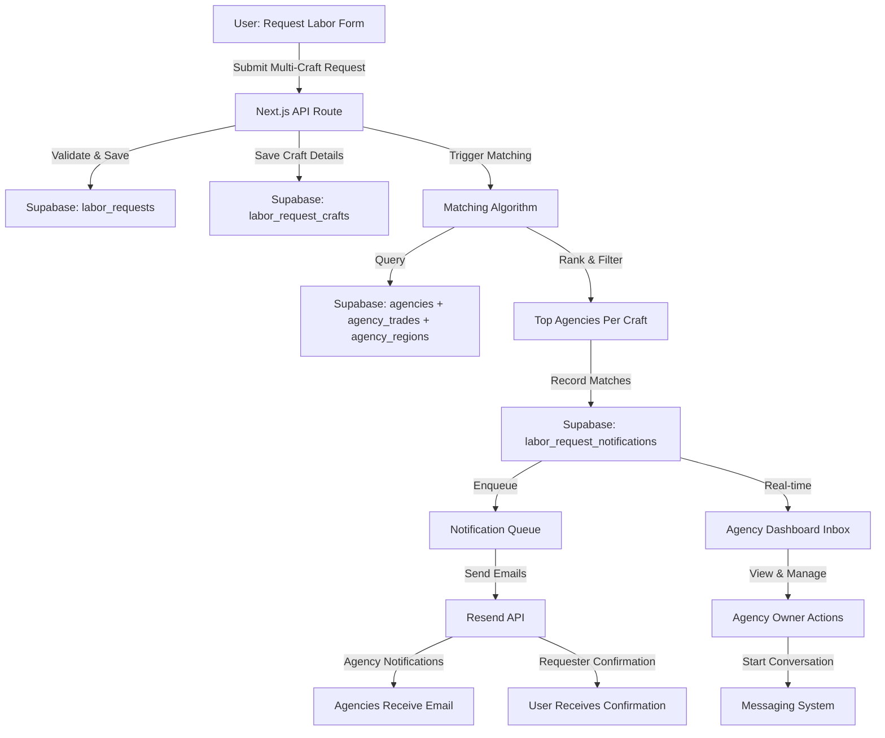
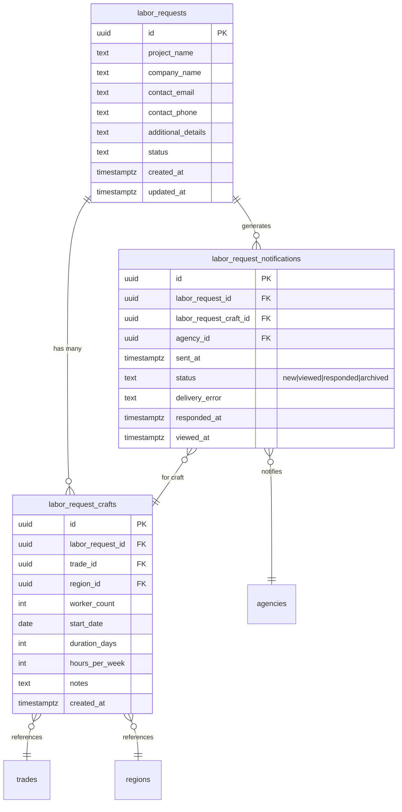

# Multi-Craft Labor Request Form Enhancement

## Overview

Transform the existing single-craft labor request form into a robust multi-craft system that allows construction companies to request multiple trades with individual specifications (workers, duration, hours/week) per craft. Implement complete end-to-end functionality including database persistence, agency matching algorithm, and notification system.

**Current State**: Simulated form with no actual data persistence or notifications
**Target State**: Production-ready multi-craft request system with matching and notifications

## Problem Statement

The current labor request form (`app/request-labor/page.tsx`) has critical limitations:

### Functional Gaps
1. **Single craft only** - Users cannot request multiple trades in one submission
2. **No database persistence** - Form submission is simulated (setTimeout fake API)
3. **No API endpoints** - No actual backend to handle submissions
4. **No matching logic** - "Top 5 agencies" claim is hardcoded text with no implementation
5. **No notification system** - Agencies are never actually notified about requests
6. **Missing hours/week field** - Users cannot specify weekly hour requirements per craft

### Technical Debt
- Form currently uses setTimeout to fake a 2-second API delay (lines 58-59)
- Success page displays misleading text about "matching requirements" that doesn't happen
- No database tables exist for labor requests
- Type definitions exist in `types/supabase.ts` but tables were never created

### Business Impact
- Construction companies cannot efficiently request multiple skilled trades
- Agencies miss out on qualified leads
- Platform cannot fulfill its core value proposition (connecting companies with staffing agencies)

## Proposed Solution

### High-Level Architecture



### Data Model (ERD)



## Technical Approach

### Phase 1: Database Foundation (Week 1)

**Goal**: Create database schema with proper indexing and RLS policies

#### Tasks

**1.1 Create Migration for Core Tables**
- File: `supabase/migrations/YYYYMMDDHHMMSS_create_labor_request_tables.sql`
- Create `labor_requests` table with status enum
- Create `labor_request_crafts` junction table with FK constraints
- Create `labor_request_notifications` tracking table
- Add composite indexes for common queries
- Set up cascade delete policies

**1.2 Add Database Indexes**
```sql
-- Composite index for matching queries
CREATE INDEX idx_craft_trade_region ON labor_request_crafts(trade_id, region_id);

-- Status filtering
CREATE INDEX idx_request_status ON labor_requests(status, created_at DESC);

-- Agency notification lookups
CREATE INDEX idx_notifications_agency ON labor_request_notifications(agency_id, sent_at);
CREATE INDEX idx_notifications_request ON labor_request_notifications(labor_request_id);

-- GIN indexes for array operations (if needed)
CREATE INDEX idx_agency_trades_gin ON agency_trades USING GIN (trade_id);
CREATE INDEX idx_agency_regions_gin ON agency_regions USING GIN (region_id);
```

**1.3 Implement RLS Policies**
```sql
-- Allow anonymous inserts for labor requests (anyone can submit)
CREATE POLICY "Anyone can create labor requests"
ON labor_requests FOR INSERT
TO anon
WITH CHECK (true);

-- Admin-only access to read all requests
CREATE POLICY "Admins can read all requests"
ON labor_requests FOR SELECT
TO authenticated
USING (auth.jwt()->>'role' = 'admin');

-- Similar policies for crafts and notifications
```

**1.4 Update TypeScript Types**
- File: `types/labor-request.ts`
- Generate types from new database schema
- Create Zod validation schemas
- Define form data types
- Create DB-to-API transformation utilities

**Acceptance Criteria**:
- [ ] Migration runs successfully in Supabase
- [ ] All tables have proper FK constraints
- [ ] Indexes improve query performance (verify with EXPLAIN ANALYZE)
- [ ] RLS policies allow anonymous submissions but protect data
- [ ] TypeScript types are auto-generated and compile without errors

---

### Phase 2: Multi-Craft Form UI (Week 2)

**Goal**: Build dynamic form interface with React Hook Form + useFieldArray

#### Tasks

**2.1 Create CraftRequestItem Component**
- File: `components/labor-request/CraftRequestItem.tsx`
- Individual craft entry card with:
  - Trade selector (searchable dropdown using existing trades)
  - Region/State selector (using existing regions)
  - Worker count input (number, 1-500)
  - Start date picker
  - Duration input (number in days)
  - Hours per week input (number, 1-168)
  - Optional notes textarea
- Remove button (disabled if only 1 craft)
- Validation error display inline

**2.2 Enhance Main Form Component**
- File: `app/request-labor/page.tsx`
- Integrate React Hook Form with Zod resolver
- Add useFieldArray for dynamic crafts management
- Implement "Add Another Craft" button (max 10 crafts)
- Add real-time total worker count display
- Add form-level validation
- Update project info section
- Improve mobile responsiveness

**2.3 Create Validation Schema**
```typescript
// types/labor-request.ts
const craftSchema = z.object({
  tradeId: z.string().uuid('Select a valid trade'),
  regionId: z.string().uuid('Select a valid location'),
  workerCount: z.coerce.number()
    .int()
    .min(1, 'At least 1 worker required')
    .max(500, 'Maximum 500 workers per craft'),
  startDate: z.string().refine(
    (date) => {
      const start = new Date(date);
      const now = new Date();
      const oneYearFromNow = new Date();
      oneYearFromNow.setFullYear(now.getFullYear() + 1);
      return start >= now && start <= oneYearFromNow;
    },
    'Start date must be between today and 1 year from now'
  ),
  durationDays: z.coerce.number()
    .int()
    .min(1, 'Minimum 1 day')
    .max(365, 'Maximum 365 days'),
  hoursPerWeek: z.coerce.number()
    .int()
    .min(1, 'Minimum 1 hour/week')
    .max(168, 'Maximum 168 hours/week'),
  notes: z.string().max(500).optional(),
});

const laborRequestSchema = z.object({
  projectName: z.string().min(3).max(200),
  companyName: z.string().min(2).max(200),
  contactEmail: z.string().email(),
  contactPhone: z.string().regex(/^\+?[\d\s()-]{10,20}$/),
  additionalDetails: z.string().max(2000).optional(),
  crafts: z.array(craftSchema)
    .min(1, 'Add at least one craft requirement')
    .max(10, 'Maximum 10 crafts per request'),
  // Note: Duplicate trade+region combinations ARE allowed (e.g., Electrician in TX + Electrician in CA)
});
```

**2.4 Improve UX with Accessibility**
- ARIA labels for all dynamic fields
- ARIA live regions for add/remove craft announcements
- Keyboard navigation support
- Screen reader testing with NVDA
- Focus management when adding/removing crafts
- Error summary section for screen readers

**Acceptance Criteria**:
- [ ] Users can add up to 10 craft requirements
- [ ] Each craft has all required fields (trade, location, workers, duration, hours/week)
- [ ] Duplicate trade/location combinations ARE allowed (e.g., same trade in different states)
- [ ] Remove button works correctly (keeps at least 1 craft)
- [ ] Form is fully accessible (WCAG 2.2 Level AA)
- [ ] Mobile layout is usable with multiple crafts
- [ ] No console errors or React warnings

---

### Phase 3: API Endpoint & Matching Logic (Week 3)

**Goal**: Implement backend submission and agency matching algorithm

#### Tasks

**3.1 Create Labor Request API Endpoint**
- File: `app/api/labor-requests/route.ts`
- Implement POST handler with rate limiting (5 req/hour per IP)
- Validate request payload with Zod
- Insert main request into `labor_requests` table
- Bulk insert crafts into `labor_request_crafts` table
- Use Supabase RPC function for atomic transaction
- Return request ID and match counts per craft

**3.2 Implement Matching Algorithm**
- File: `lib/matching/agency-matcher.ts`
- Core matching logic:
  ```typescript
  async function matchAgenciesToCraft(craft: CraftRequest): Promise<AgencyMatch[]> {
    // 1. Hard filters (must match)
    const candidates = await supabase
      .from('agencies')
      .select(`
        id, name, slug, verified,
        agency_trades!inner(trade_id),
        agency_regions!inner(region_id)
      `)
      .eq('agency_trades.trade_id', craft.tradeId)
      .eq('agency_regions.region_id', craft.regionId)
      .eq('verified', true); // Only verified agencies

    // 2. Score and rank
    const scored = candidates.map(agency => ({
      agency,
      score: calculateMatchScore(agency, craft)
    }));

    // 3. Sort by score descending
    scored.sort((a, b) => b.score - a.score);

    // 4. Return top 5
    return scored.slice(0, 5);
  }

  function calculateMatchScore(agency: Agency, craft: CraftRequest): number {
    let score = 100; // Base score

    // Bonus for verification badges
    if (agency.certifications?.length > 0) score += 20;

    // Bonus for capacity match
    if (agency.min_project_size <= craft.workerCount &&
        agency.max_project_size >= craft.workerCount) {
      score += 10;
    }

    // Penalty if agency at capacity (future: check existing commitments)
    // For now, just use static fields

    return score;
  }
  ```

**3.3 Create Matching RPC Function**
```sql
-- supabase/migrations/create_matching_function.sql
CREATE OR REPLACE FUNCTION match_agencies_to_craft(
  p_trade_id UUID,
  p_region_id UUID,
  p_worker_count INTEGER
) RETURNS TABLE(
  agency_id UUID,
  agency_name TEXT,
  agency_slug TEXT,
  match_score INTEGER
) AS $$
BEGIN
  RETURN QUERY
  SELECT
    a.id,
    a.name,
    a.slug,
    (
      CASE WHEN a.verified THEN 120 ELSE 100 END +
      CASE
        WHEN a.min_project_size <= p_worker_count
         AND a.max_project_size >= p_worker_count
        THEN 10 ELSE 0
      END
    )::INTEGER AS match_score
  FROM agencies a
  WHERE
    EXISTS (
      SELECT 1 FROM agency_trades
      WHERE agency_id = a.id AND trade_id = p_trade_id
    )
    AND EXISTS (
      SELECT 1 FROM agency_regions
      WHERE agency_id = a.id AND region_id = p_region_id
    )
  ORDER BY match_score DESC
  LIMIT 5;
END;
$$ LANGUAGE plpgsql;
```

**3.4 Handle Edge Cases**
- Zero matches for a craft: Log warning, continue with other crafts
- Fewer than 5 matches: Return all available (1-4)
- Same agency matches multiple crafts: Consolidate notifications (handle in Phase 4)
- Timeout handling: 30-second overall timeout, return partial results if needed

**Acceptance Criteria**:
- [ ] API endpoint accepts valid multi-craft requests
- [ ] Request + crafts saved atomically to database
- [ ] Matching algorithm returns top 5 agencies per craft
- [ ] Handles edge cases (0 matches, duplicate agencies, etc.)
- [ ] Returns meaningful error messages for validation failures
- [ ] Rate limiting prevents abuse (5 req/hour per IP)
- [ ] Integration tests cover happy path and error cases

---

### Phase 4: Notification System (Week 4)

**Goal**: Send email notifications to matched agencies and requester

#### Tasks

**4.1 Create Email Templates**
- File: `lib/emails/labor-request-agency-notification.tsx`
- React Email template for agencies:
  - Project name and company
  - Craft details (trade, location, workers, duration, hours/week)
  - Contact information
  - "View Full Request" CTA button
  - Footer with unsubscribe link

- File: `lib/emails/labor-request-confirmation.tsx`
- React Email template for requester:
  - Thank you message
  - Summary of submitted crafts
  - "We've notified X agencies" with breakdown per craft
  - What to expect next (agencies will contact you)
  - Support contact info

**4.2 Implement Notification Service**
- File: `lib/notifications/labor-request-notifier.ts`
```typescript
import { Resend } from 'resend';

const resend = new Resend(process.env.RESEND_API_KEY);

export async function notifyMatchedAgencies(
  requestId: string,
  craftId: string,
  agencies: AgencyMatch[]
) {
  const notifications: NotificationRecord[] = [];

  for (const agency of agencies) {
    try {
      // Send email via Resend
      await resend.emails.send({
        from: 'requests@findconstructionstaffing.com',
        to: agency.email,
        subject: `New Labor Request: ${craft.tradeName} in ${craft.regionName}`,
        react: AgencyNotificationEmail({ request, craft, agency }),
      });

      // Record successful notification
      notifications.push({
        labor_request_id: requestId,
        labor_request_craft_id: craftId,
        agency_id: agency.id,
        sent_at: new Date().toISOString(),
        status: 'sent',
        delivery_error: null,
      });
    } catch (error) {
      // Record failed notification
      notifications.push({
        labor_request_id: requestId,
        labor_request_craft_id: craftId,
        agency_id: agency.id,
        sent_at: new Date().toISOString(),
        status: 'failed',
        delivery_error: error.message,
      });
    }
  }

  // Bulk insert notification records
  await supabase
    .from('labor_request_notifications')
    .insert(notifications);
}
```

**4.3 Consolidate Notifications for Multi-Craft Matches**
```typescript
// If same agency matches multiple crafts, send single consolidated email
export async function sendConsolidatedNotifications(
  requestId: string,
  matchesByCraft: Map<string, AgencyMatch[]>
) {
  // Group by agency ID
  const byAgency = new Map<string, CraftMatch[]>();

  for (const [craftId, matches] of matchesByCraft) {
    for (const match of matches) {
      if (!byAgency.has(match.agency.id)) {
        byAgency.set(match.agency.id, []);
      }
      byAgency.get(match.agency.id)!.push({ craftId, ...match });
    }
  }

  // Send one email per agency with all their matched crafts
  for (const [agencyId, crafts] of byAgency) {
    await resend.emails.send({
      from: 'requests@findconstructionstaffing.com',
      to: crafts[0].agency.email,
      subject: `New Multi-Craft Labor Request (${crafts.length} trades)`,
      react: MultiCraftAgencyEmail({ crafts, request }),
    });
  }
}
```

**4.4 Add Background Job Queue (Optional Enhancement)**
- Consider using Inngest or Trigger.dev for reliable async processing
- Retry failed notifications (3 attempts with exponential backoff)
- Dead letter queue for permanently failed notifications
- Admin dashboard to view notification status

**Acceptance Criteria**:
- [ ] Agency notification emails are sent successfully
- [ ] Requester confirmation email is sent immediately
- [ ] Multi-craft matches to same agency result in single consolidated email
- [ ] Failed notifications are logged with error details
- [ ] Email templates render correctly in major clients (Gmail, Outlook, Apple Mail)
- [ ] Unsubscribe links work (agencies can opt-out)
- [ ] Notification records are stored in database for audit trail

---

### Phase 5: Success Page & User Feedback (Week 5)

**Goal**: Improve confirmation page with real match data

#### Tasks

**5.1 Create Success Page Component**
- File: `app/request-labor/success/page.tsx`
- Display dynamic match results per craft
- Show which agencies were notified (count, not names for privacy)
- Provide next steps guidance
- Add "Submit Another Request" CTA
- Include support contact information

**5.2 Update Form Submission Flow**
```typescript
// app/request-labor/page.tsx
const onSubmit = async (data: LaborRequestFormData) => {
  try {
    setIsSubmitting(true);

    const response = await fetch('/api/labor-requests', {
      method: 'POST',
      headers: { 'Content-Type': 'application/json' },
      body: JSON.stringify(data),
    });

    if (!response.ok) {
      const error = await response.json();
      throw new Error(error.message || 'Submission failed');
    }

    const result = await response.json();

    // Redirect to success page with results
    router.push(`/request-labor/success?requestId=${result.requestId}`);
  } catch (error) {
    toast.error(error.message);
    setIsSubmitting(false);
  }
};
```

**5.3 Display Match Results**
```tsx
// app/request-labor/success/page.tsx
export default async function SuccessPage({ searchParams }) {
  const { requestId } = searchParams;

  // Fetch match results
  const { data: request } = await supabase
    .from('labor_requests')
    .select(`
      *,
      crafts:labor_request_crafts(
        *,
        trade:trades(name),
        region:regions(name),
        notifications:labor_request_notifications(count)
      )
    `)
    .eq('id', requestId)
    .single();

  return (
    <div className="success-container">
      <CheckCircle className="text-green-600" size={64} />
      <h1>Request Submitted Successfully!</h1>

      <div className="match-summary">
        {request.crafts.map(craft => (
          <div key={craft.id} className="craft-match-card">
            <h3>{craft.trade.name} - {craft.region.name}</h3>
            <p>{craft.notifications.count} agencies notified</p>
            <p>{craft.worker_count} workers for {craft.duration_days} days</p>
          </div>
        ))}
      </div>

      <div className="next-steps">
        <h2>What happens next?</h2>
        <ol>
          <li>Agencies will review your request</li>
          <li>Interested agencies will contact you directly at {request.contact_email}</li>
          <li>You'll receive responses within 24-48 hours</li>
        </ol>
      </div>
    </div>
  );
}
```

**Acceptance Criteria**:
- [ ] Success page displays actual match counts per craft
- [ ] Users understand what to expect next
- [ ] Zero-match crafts are clearly indicated with alternative actions
- [ ] Page is accessible and mobile-friendly
- [ ] "Submit Another Request" button works

---

### Phase 6: Agency Dashboard Inbox (Week 6)

**Goal**: Enable agency owners to view and manage incoming labor requests from their dashboard

**Context**: Currently, agencies have a dashboard at `/dashboard/agency/[slug]` that shows profile completion, analytics, and settings. The dashboard sidebar does NOT include navigation to view incoming labor requests. The DashboardOverview component shows a "Lead Requests" stat card hardcoded to 0 with "Coming soon" description.

#### Tasks

**6.1 Update Dashboard Navigation**
- File: `components/dashboard/DashboardSidebar.tsx`
- Add "Requests" navigation item to sidebar (lines 49-76):
  ```typescript
  {
    name: 'Requests',
    href: `/dashboard/agency/${agencySlug}/requests`,
    icon: Inbox, // Import from lucide-react
  },
  ```
- Position between "Compliance" and "Analytics"

**6.2 Update Dashboard Stats Card**
- File: `components/dashboard/DashboardOverview.tsx`
- Replace hardcoded "Lead Requests" stat with real query count (lines 62-66)
- Fetch count from `labor_request_notifications` table filtered by agency_id
- Show count of unread/pending requests
- Update description from "Coming soon" to "View all →" with link

**6.3 Create Agency Requests Page**
- File: `app/(app)/dashboard/agency/[slug]/requests/page.tsx`
- Server component that verifies agency ownership (similar to compliance page pattern)
- Fetch labor requests where agency was notified:
  ```sql
  SELECT
    lr.*,
    lrc.*,
    lrn.sent_at,
    lrn.responded_at,
    t.name as trade_name,
    r.name as region_name
  FROM labor_request_notifications lrn
  INNER JOIN labor_request_crafts lrc ON lrn.labor_request_craft_id = lrc.id
  INNER JOIN labor_requests lr ON lrn.labor_request_id = lr.id
  INNER JOIN trades t ON lrc.trade_id = t.id
  INNER JOIN regions r ON lrc.region_id = r.id
  WHERE lrn.agency_id = $agencyId
  ORDER BY lrn.sent_at DESC
  ```
- Group requests by `labor_request_id` (multiple crafts may belong to same request)
- Display in card/table format with filters

**6.4 Create Requests Inbox Component**
- File: `components/dashboard/RequestsInbox.tsx`
- Client component for interactive filtering and actions
- Features:
  - **Tabs**: "All" | "New" | "Responded" | "Archived"
  - **Filters**: By trade, date range, worker count
  - **Search**: By project name or company
  - **Sort**: By date (newest first), worker count, duration
- Each request card shows:
  - Project name and company
  - Craft details (trade, location, # workers, duration, hours/week)
  - Contact information (email, phone)
  - Request date
  - Status badge (New, Viewed, Responded)
  - Action buttons (View Details, Respond, Archive)

**6.5 Create Request Detail Modal**
- File: `components/dashboard/RequestDetailModal.tsx`
- Full request details in modal overlay
- Display:
  - All craft requirements if multi-craft request
  - Project notes and additional details
  - Full contact information
  - Timestamp when agency was notified
- Actions:
  - "Mark as Responded" button
  - "Start Conversation" button → creates conversation in messaging system
  - "Archive" button → soft delete/hide from inbox
  - "Copy Contact Info" button

**6.6 Add Status Tracking**
- Extend `labor_request_notifications` table with status field:
  ```sql
  ALTER TABLE labor_request_notifications
  ADD COLUMN viewed_at TIMESTAMPTZ,
  ADD COLUMN status TEXT DEFAULT 'new'
    CHECK (status IN ('new', 'viewed', 'responded', 'archived'));
  ```
- Update status when agency opens request detail
- Create API endpoint: `PATCH /api/labor-requests/notifications/[id]` to update status

**6.7 Integrate with Messaging System (Optional)**
- When agency clicks "Start Conversation" on a request:
  - Create new conversation with `context_type: 'labor_request'`
  - Set `context_id` to `labor_request_id`
  - Add both agency owner and requester as participants
  - Send initial message template (auto-populated with request summary)
  - Redirect to `/messages/conversations/[conversationId]`

**6.8 Add Real-Time Notifications**
- Use Supabase Realtime subscriptions for new requests:
  ```typescript
  const channel = supabase
    .channel('labor-requests')
    .on(
      'postgres_changes',
      {
        event: 'INSERT',
        schema: 'public',
        table: 'labor_request_notifications',
        filter: `agency_id=eq.${agencyId}`
      },
      (payload) => {
        // Show toast notification
        toast.success('New labor request received!');
        // Increment badge count
        incrementRequestCount();
      }
    )
    .subscribe();
  ```
- Badge count on sidebar "Requests" link showing unread count
- Browser notification permission prompt (optional)

**Reference Patterns**:
- Agency dashboard layout: `app/(app)/dashboard/agency/[slug]/layout.tsx`
- Ownership verification: `app/(app)/dashboard/agency/[slug]/compliance/page.tsx` (lines 20-84)
- Stats card component: `components/dashboard/StatsCard.tsx`
- Existing messaging inbox: `app/messages/page.tsx` and `components/messages/MessagesInboxClient.tsx`

**Acceptance Criteria**:
- [ ] "Requests" navigation link appears in agency dashboard sidebar
- [ ] Lead Requests stat card shows actual count from database
- [ ] Agency requests page loads only for verified agency owners
- [ ] Requests are displayed in chronological order (newest first)
- [ ] Filtering and search work correctly
- [ ] Status updates persist to database
- [ ] "Start Conversation" creates proper conversation thread
- [ ] Real-time notifications work for new incoming requests
- [ ] Badge count updates automatically
- [ ] Page is responsive and mobile-friendly
- [ ] No N+1 query issues (use proper joins/includes)

**Database Query Optimization**:
```sql
-- Create composite index for fast agency request lookups
CREATE INDEX idx_labor_request_notifications_agency_status
  ON labor_request_notifications(agency_id, status, sent_at DESC);

-- Create index for request details join
CREATE INDEX idx_labor_request_crafts_request_id
  ON labor_request_crafts(labor_request_id);
```

---

## Alternative Approaches Considered

### Approach A: JSONB Array for Crafts (Rejected)

**Pros**:
- Single table, simpler schema
- Faster writes (one INSERT vs N+1)
- Flexible schema evolution

**Cons**:
- Cannot query "all requests for Electricians in TX" efficiently
- No referential integrity for trade/region foreign keys
- Harder to generate reports on popular trades
- Matching algorithm more complex (JSON parsing)

**Decision**: Use normalized junction table for queryability and data integrity

### Approach B: Synchronous Notifications (Rejected)

**Pros**:
- Simpler implementation (no job queue)
- User sees immediate confirmation

**Cons**:
- Poor UX (user waits 10+ seconds for 50 emails to send)
- No retry logic for failed notifications
- Request submission could fail due to email API issues
- Doesn't scale (10 crafts × 5 agencies = 50 emails)

**Decision**: Use async notifications with background processing

### Approach C: Generic "Request" Table for All Types (Rejected)

**Pros**:
- Could support future request types (equipment, materials)
- DRY principle

**Cons**:
- Over-engineering for current needs
- More complex querying with type discrimination
- Harder to understand schema

**Decision**: Dedicated `labor_requests` table, revisit if other request types emerge

---

## Acceptance Criteria

### Functional Requirements

- [ ] Users can add 1-10 craft requirements per request
- [ ] Each craft specifies: trade, location, workers, duration, hours/week, optional notes
- [ ] System allows duplicate trade/location combinations (same trade in different states)
- [ ] System validates all inputs (ranges, formats, future dates)
- [ ] Matching algorithm finds top 5 verified agencies per craft based on trade + location
- [ ] Matched agencies receive email notifications with full request details
- [ ] Requester receives confirmation email with match summary
- [ ] Same agency matching multiple crafts receives single consolidated email
- [ ] Zero-match crafts are clearly indicated to user
- [ ] All data is persisted to database (no more simulation)

### Non-Functional Requirements

- [ ] Form submission completes in <3 seconds (excluding email sending)
- [ ] Matching algorithm handles 10 crafts in <5 seconds
- [ ] Email notifications sent asynchronously (don't block user)
- [ ] API endpoint has rate limiting (5 requests/hour per IP)
- [ ] Database queries use proper indexes (verified with EXPLAIN ANALYZE)
- [ ] Form is accessible (WCAG 2.2 Level AA)
- [ ] Mobile-responsive layout works with 1, 3, 5+ crafts
- [ ] No console errors or React warnings
- [ ] TypeScript compiles without errors
- [ ] All migrations run successfully in Supabase

### Quality Gates

- [ ] Unit tests for matching algorithm (100% coverage)
- [ ] Integration tests for API endpoint (happy path + error cases)
- [ ] E2E test for complete submission flow (Playwright)
- [ ] Accessibility audit passes (axe DevTools, Wave)
- [ ] Email templates tested in Litmus or Email on Acid
- [ ] Load test: 100 concurrent submissions without errors
- [ ] Security review: SQL injection, XSS, CSRF protection
- [ ] Code review approved by 2+ team members

---

## Success Metrics

### User Engagement
- **Metric**: Average crafts per request
- **Target**: 2.5 crafts/request (indicates users leverage multi-craft feature)
- **Measurement**: Track `COUNT(labor_request_crafts) / COUNT(labor_requests)`

### Conversion Rate
- **Metric**: Requests submitted vs. form loads
- **Target**: 40% conversion rate (up from current unknown baseline)
- **Measurement**: Analytics event tracking

### Match Quality
- **Metric**: Average agencies matched per craft
- **Target**: 4+ agencies/craft (out of max 5)
- **Measurement**: `AVG(notification_count) FROM labor_request_crafts`

### Response Rate
- **Metric**: Agencies responding to notifications
- **Target**: 30% response rate within 48 hours
- **Measurement**: Track `responded_at` in notifications table

### System Reliability
- **Metric**: Notification delivery success rate
- **Target**: 99% successful delivery
- **Measurement**: `COUNT(status='sent') / COUNT(*) FROM labor_request_notifications`

### Agency Dashboard Engagement
- **Metric**: Percentage of agencies viewing requests in dashboard
- **Target**: 70% of notified agencies view requests within 24 hours
- **Measurement**: `COUNT(viewed_at IS NOT NULL) / COUNT(*) WHERE sent_at > NOW() - INTERVAL '24 hours'`

### Agency Action Rate
- **Metric**: Agencies taking action (respond/conversation) on requests
- **Target**: 40% of viewed requests result in agency action
- **Measurement**: `COUNT(responded_at IS NOT NULL OR conversation_started) / COUNT(viewed_at IS NOT NULL)`

---

## Clarifying Questions & Decisions

**Status**: ✅ All questions answered by stakeholder on 2026-01-14

### Decisions Summary
- **Max crafts**: 10 per request
- **Authentication**: Contact info required, no login needed initially
- **Matching**: Verified agencies only, no capacity checking
- **Contact reveal**: Direct contact info in agency notification (simplified flow for MVP)
- **Future**: Proposal/budget system deferred to Phase 7
- **Notifications**: Immediate send, consolidated for multi-craft
- **Data retention**: Indefinite
- **Request expiration**: Auto-archive after 30 days
- **Rate limiting**: 5 requests/hour per IP

---

## Clarifying Questions (ANSWERED)

~~Before starting implementation, these questions need answers from stakeholders:~~

### Business Rules & Validation

1. **Maximum crafts per request**: ✅ **10 crafts is correct**
2. **Duplicate combinations**: ✅ **Yes, allow same trade in different locations** (e.g., Electrician in TX AND Electrician in CA)
3. **Future start dates**: ✅ **Up to 1 year in advance**
4. **Minimum duration**: ✅ **Keep 1 day minimum** (no change needed)
5. **Hours per week validation**: ✅ **No cross-field validation needed** (trust user input)

### Matching Algorithm

6. **Verified agencies only**: ✅ **Yes, ONLY verified agencies** (hard filter)
7. **Zero matches scenario**: ✅ **Allow submission, show message "No agencies matched for [craft]"** (no suggestions)
8. **Matching criteria weights**: ✅ **Keep current plan** (verified status > capacity match > certifications)
9. **Agency capacity**: ✅ **No capacity checking** (send to all matching verified agencies)
10. **Regional preferences**: ✅ **No regional priority** (all matching regions treated equally)

### Notifications

11. **Notification timing**: ✅ **Send immediately** (no batching)
12. **Notification consolidation**: ✅ **Yes, 1 consolidated email** for multi-craft matches
13. **Email from address**: ✅ **Use `requests@findconstructionstaffing.com`**
14. **Reply-to address**: ✅ **Agencies reply directly to requester's email** (included in notification)
15. **Unsubscribe handling**: 🔜 **Defer to future** (out of scope for Phase 1)
16. **Failed delivery retry**: ✅ **Keep 3 retries with exponential backoff**
17. **Agency notification preferences**: ✅ **No quiet hours or daily digest** (instant only for now)

### Privacy & Contact Information

18. **Contact info visibility**: ✅ **Immediately in email notification** (simplified MVP flow)
    - **Note**: Future Phase 7 will add proposal/budget system with conditional reveal
19. **Data retention**: ✅ **Indefinite** (keep all labor request data permanently)
20. **GDPR/Privacy compliance**: ✅ **No consent checkboxes needed** (US-focused platform)
21. **Agency contact visibility**: ✅ **Just the count** (no specific agency names shown to requester)

### Agency Dashboard

22. **Request expiration**: ✅ **Auto-archive after 30 days**
23. **Response tracking**: ✅ **Responded = agency sends message through system** (trackable via messaging)
24. **Multi-agency coordination**: ✅ **Out of scope** (requester handles via email, future: requester dashboard)
25. **Agency workload limits**: ✅ **No limits** (send all matching requests)

### Form UX & User Flow

26. **Authentication required**: ✅ **No auth required, just contact info** (email + phone required for routing)
27. **Save draft functionality**: ✅ **No draft saving** (out of scope for now)
28. **Edit after submission**: ✅ **No edit/cancel initially** (add later with requester dashboard)
29. **Request history**: 🔜 **Future: Requester dashboard** (Phase 7+)
30. **Pre-fill from previous**: ✅ **No pre-fill** (no user accounts yet)

### Success Page & Follow-up

31. **Zero-match messaging**: ✅ **Just informational message** (no suggestions/alternatives)
32. **Expected response time**: ✅ **Keep "24-48 hours" messaging**
33. **Confirmation email**: ✅ **Yes, send confirmation email** with request summary and match counts
34. **Status tracking**: 🔜 **Future with requester dashboard** (Phase 7+)

### Technical & Infrastructure

35. **Rate limiting**: ✅ **5 requests/hour per IP is correct**
36. **Webhook notifications**: 🔜 **Defer to future** (out of scope)
37. **API versioning**: ✅ **Follow site standard** (use consistent versioning across all API routes)

### Agency Dashboard Specific

38. **Request visibility**: ✅ **No, agencies cannot see who else was notified**
39. **Conversation creation**: ✅ **Platform mediates** (standard messaging system flow)
40. **Bulk actions**: ✅ **No bulk actions** (individual request management only)

---

## Dependencies & Prerequisites

### External Dependencies
- **Resend API**: Email delivery service (already integrated)
- **Supabase**: Database and authentication (already integrated)
- **React Hook Form**: Form state management (already installed v7.69.0)
- **Zod**: Validation schema (already installed v3.25.76)

### Internal Dependencies
- **Existing tables**: `trades`, `regions`, `agencies`, `agency_trades`, `agency_regions`
- **Existing components**: TradeSelector, RegionSelector patterns from AgencyFormModal
- **Existing email infrastructure**: Resend integration from `lib/emails/`

### Prerequisite Work
1. Confirm matching algorithm ranking criteria with product team
2. Finalize email template copy with marketing team
3. Review privacy policy for contact information handling
4. Set up monitoring/alerting for notification failures

---

## Risk Analysis & Mitigation

### Risk: Database migration fails in production
- **Likelihood**: Low
- **Impact**: High (feature completely blocked)
- **Mitigation**: Test migration in staging environment first, have rollback SQL ready
- **Rollback Plan**: `DROP TABLE labor_request_notifications; DROP TABLE labor_request_crafts; DROP TABLE labor_requests;`

### Risk: Email notifications hit rate limits
- **Likelihood**: Medium (if viral growth or bulk submissions)
- **Impact**: Medium (delays in agency notifications)
- **Mitigation**: Implement queuing system (Inngest/Trigger.dev) with retry logic, monitor Resend API usage
- **Fallback**: Batch notifications, add delay between sends

### Risk: Matching algorithm returns zero results for niche trades/locations
- **Likelihood**: High (inevitable for some combinations)
- **Impact**: Low (user disappointment, but expected)
- **Mitigation**: Clear messaging on zero matches, suggest broadening criteria, offer manual support contact
- **Enhancement**: "No agencies found - would you like to search nearby regions?"

### Risk: Users submit spam or test requests
- **Likelihood**: Medium (no authentication barrier)
- **Impact**: Medium (noise for agencies, wasted notifications)
- **Mitigation**: Rate limiting (5/hour per IP), CAPTCHA on 3rd failed submission, admin review queue for suspicious patterns
- **Detection**: Flag requests with invalid emails, excessive worker counts, or profanity in notes

### Risk: Agency notification emails go to spam
- **Likelihood**: Medium (depends on email client/configuration)
- **Impact**: Medium (agencies miss legitimate leads)
- **Mitigation**: SPF/DKIM/DMARC configuration in Resend, avoid spam trigger words, personalized from address, clear subject lines
- **Monitoring**: Track email open rates, add "Didn't receive notification?" link in agency dashboard

### Risk: Mobile UX degrades with 5+ crafts
- **Likelihood**: Low (most requests 2-3 crafts based on user research)
- **Impact**: Medium (poor experience for power users)
- **Mitigation**: Test on real devices, implement virtual scrolling if needed, consider wizard/stepper UI for 5+ crafts
- **Alternative**: "Add More Than 5 Crafts" button switches to bulk upload CSV mode

### Risk: Performance degradation with 10 crafts × 5 agencies = 50 notifications
- **Likelihood**: Low (edge case)
- **Impact**: Low (handled by async processing)
- **Mitigation**: Background job queue, batching, monitoring job queue depth
- **Threshold**: Alert if notification queue > 500 pending jobs

---

## Resource Requirements

### Development Time
- **Phase 1 (Database)**: 1 week (1 developer)
- **Phase 2 (Form UI)**: 1.5 weeks (1 frontend developer)
- **Phase 3 (API/Matching)**: 1.5 weeks (1 backend developer)
- **Phase 4 (Notifications)**: 1 week (1 developer)
- **Phase 5 (Success Page)**: 0.5 weeks (1 frontend developer)
- **Phase 6 (Agency Dashboard Inbox)**: 1.5 weeks (1 full-stack developer)
- **Testing & QA**: 1 week (1 QA engineer)
- **Total**: ~7-8 weeks with 2 developers

### Infrastructure
- **Supabase**: No additional cost (within current tier)
- **Resend**: Increased email volume - monitor pricing tier
- **Monitoring**: Set up error tracking (Sentry) and logging (LogDNA)

### Third-Party Services
- **Email**: Resend (existing, may need tier upgrade)
- **Background Jobs** (optional): Inngest free tier or Trigger.dev

---

## Future Considerations

### Phase 7: Proposal/Budget System (Next Major Feature)

**Priority**: High - Deferred from Phase 1-6 to simplify MVP

**Overview**: Instead of revealing requester contact info immediately, implement a proposal workflow where agencies submit non-binding price estimates before direct contact.

**New Workflow**:
1. Agency receives notification (NO contact info included)
2. Agency views request in dashboard → Submits proposal
   - Non-binding price estimate
   - Message/questions for requester
   - Timeline estimate
3. Requester receives notification of proposals
4. Requester reviews proposals in simplified inbox
5. Requester replies to a proposal → **Contact info revealed to that agency only**
6. Agency can now contact requester directly

**Database Changes**:
```sql
CREATE TABLE labor_request_proposals (
  id UUID PRIMARY KEY DEFAULT gen_random_uuid(),
  labor_request_id UUID REFERENCES labor_requests(id),
  labor_request_craft_id UUID REFERENCES labor_request_crafts(id),
  agency_id UUID REFERENCES agencies(id),
  price_estimate DECIMAL(10,2),
  currency TEXT DEFAULT 'USD',
  message TEXT,
  timeline_estimate TEXT,
  submitted_at TIMESTAMPTZ DEFAULT NOW(),
  requester_viewed_at TIMESTAMPTZ,
  requester_replied_at TIMESTAMPTZ,
  status TEXT DEFAULT 'pending' CHECK (status IN ('pending', 'viewed', 'accepted', 'declined'))
);
```

**Benefits**:
- Requester privacy protected until they choose
- Platform captures pricing data for analytics
- Agencies write custom pitches (higher engagement)
- Platform becomes marketplace vs just directory

**Estimated Effort**: 2-3 weeks

---

### Phase 8+: Advanced Features (Post-MVP)

**Requester Dashboard**
- Authenticated users can view request history
- Edit submitted requests (re-triggers matching)
- Track agency responses in real-time
- Mark requests as fulfilled/cancelled
- Status tracking: "3 agencies viewed, 1 responded"

**Agency Response Tracking**
- Track response rates per agency for quality scoring
- Auto-reminder if no responses after 48 hours
- Agency performance metrics in matching algorithm

**Geographic Radius Matching**
- Instead of exact state match, allow "within 50 miles of Houston"
- Requires geocoding and distance calculation
- Opens up more agency matches in border regions

**Bulk CSV Upload**
- For large projects with 20+ crafts
- CSV template with columns: trade, location, workers, duration, hours/week
- Validation and preview before submission

**Agency Notification Preferences**
- Agencies set minimum worker count (don't notify for <10 workers)
- Preferred trades (only notify for certified specialties)
- Blacklist certain requesters

**SMS Notifications**
- Alternative/supplement to email
- Requires Twilio integration
- Higher urgency for time-sensitive requests

---

## Documentation Plan

### User-Facing Documentation

**Help Article**: "How to Submit a Labor Request"
- Location: `/docs/help/submit-labor-request.md`
- Includes: Screenshots of form, field explanations, FAQs
- Target audience: Construction companies

**Help Article**: "Understanding Agency Matching"
- Location: `/docs/help/agency-matching.md`
- Explains: How matching works, why some crafts have fewer matches
- Target audience: Requesters

**Email Template Copy**
- Work with marketing to finalize agency notification wording
- A/B test subject lines for open rates
- Legal review of unsubscribe compliance

### Developer Documentation

**API Reference**
- Location: `/docs/api/labor-requests.md`
- Document `POST /api/labor-requests` endpoint
- Include request/response schemas
- Example curl commands
- Error codes and handling

**Database Schema**
- Location: `/docs/database/labor-requests-schema.md`
- ERD diagram (Mermaid)
- Table descriptions
- Index strategy explanation
- RLS policy documentation

**Matching Algorithm**
- Location: `/docs/architecture/matching-algorithm.md`
- Explain scoring criteria
- Document future enhancement ideas
- Performance benchmarks

---

## Testing Strategy

### Unit Tests

**Validation Schema** (`types/labor-request.test.ts`)
- Valid request passes
- Missing required fields fails
- Invalid worker counts fails
- Start date > 1 year in future fails
- Hours per week > 168 fails
- Duplicate craft combinations allowed (same trade, different locations)

**Matching Algorithm** (`lib/matching/agency-matcher.test.ts`)
- Returns top 5 agencies when >5 available
- Returns all when <5 available
- Returns empty array when 0 match
- Verified agencies prioritized over unverified
- Correct scoring calculation

**Notification Service** (`lib/notifications/labor-request-notifier.test.ts`)
- Sends email successfully
- Records successful notification in DB
- Handles email API failures gracefully
- Records failed notification with error
- Consolidates multi-craft matches correctly

### Integration Tests

**API Endpoint** (`app/api/labor-requests/route.test.ts`)
- POST with valid data returns 200 + requestId
- POST with invalid data returns 400 + errors
- Rate limiting returns 429 after 5 requests
- Database transaction is atomic (all or nothing)
- Matching is triggered after successful insert

### E2E Tests (Playwright)

**Happy Path**: Complete Submission Flow
1. Navigate to /request-labor
2. Fill project name and contact info
3. Add 3 crafts with valid data
4. Submit form
5. Verify redirect to success page
6. Verify match counts displayed
7. Verify confirmation email sent (check test inbox)

**Error Path**: Validation Errors
1. Navigate to /request-labor
2. Add 2 crafts
3. Leave required fields empty on craft 2
4. Click submit
5. Verify inline errors displayed
6. Verify focus moved to first error
7. Fix errors and resubmit successfully

**Edge Case**: Zero Matches
1. Submit request for obscure trade in remote location
2. Verify success page shows "0 agencies notified"
3. Verify alternative actions displayed
4. Verify requester still receives confirmation email

### Manual Testing Checklist

**Accessibility**
- [ ] Tab through entire form using keyboard only
- [ ] Add/remove crafts using keyboard (Enter/Space)
- [ ] Screen reader announces craft additions/removals (NVDA)
- [ ] All form fields have proper labels
- [ ] Error messages are associated with fields (aria-describedby)
- [ ] Success page announces results to screen reader

**Cross-Browser**
- [ ] Chrome (Windows/Mac)
- [ ] Firefox (Windows/Mac)
- [ ] Safari (Mac/iOS)
- [ ] Edge (Windows)
- [ ] Mobile Safari (iPhone)
- [ ] Mobile Chrome (Android)

**Email Clients**
- [ ] Gmail (web, Android, iOS)
- [ ] Outlook (desktop, web)
- [ ] Apple Mail (Mac, iOS)
- [ ] Yahoo Mail
- [ ] Check spam folder placement

**Responsive Design**
- [ ] Desktop (1920x1080)
- [ ] Laptop (1366x768)
- [ ] Tablet (768x1024)
- [ ] Mobile (375x667)
- [ ] Mobile landscape

---

## Rollback Plan

### If Critical Bug Found in Production

**Step 1: Immediate Mitigation**
- Disable form submission by adding feature flag check
- Display maintenance message: "Labor request submission temporarily unavailable"
- Keep existing form UI intact (no code rollback needed)

**Step 2: Assess Impact**
- Check Sentry for error volume and types
- Query database for corrupt/incomplete requests
- Contact affected users if data loss occurred

**Step 3: Fix Forward or Rollback**
- **Minor bug**: Hot-fix and redeploy (< 2 hours)
- **Major bug**: Rollback database migration if needed
```sql
-- Rollback script
DROP TABLE IF EXISTS labor_request_notifications;
DROP TABLE IF EXISTS labor_request_crafts;
DROP TABLE IF EXISTS labor_requests;
```

**Step 4: Re-enable After Fix**
- Deploy fix to staging
- Test critical path end-to-end
- Re-enable in production with monitoring
- Communicate with users about downtime

### Database Rollback Considerations

**Safe to rollback if**:
- No production requests submitted yet
- < 10 test requests in database
- Within first 24 hours of deployment

**NOT safe to rollback if**:
- >100 production requests exist
- Agencies have responded to requests
- Requesters are waiting on agency contact

In this case, fix-forward only.

---

## References & Research

### Internal References

**Existing Patterns**:
- `components/dashboard/TradeSelectionModal.tsx` - Multi-select with search
- `components/dashboard/RegionSelectionModal.tsx` - Multi-select with quick filters
- `components/admin/AgencyFormModal.tsx` - Complex form with external state tracking
- `lib/emails/send-message-notification.ts` - Existing Resend integration
- `app/api/agencies/route.ts` - Agency filtering with trade/region joins

**Database Schema**:
- `supabase/migrations/` - Existing migration patterns
- `types/supabase.ts` - Type definitions (Lead type exists but tables don't)

### External References

**React Hook Form**:
- [useFieldArray Documentation](https://react-hook-form.com/docs/usefieldarray)
- [Zod Integration Guide](https://www.contentful.com/blog/react-hook-form-validation-zod/)

**Supabase**:
- [Bulk Insert Patterns](https://supabase.com/docs/reference/javascript/insert)
- [Array Queries](https://supabase.com/docs/reference/javascript/overlaps)
- [RLS Policies](https://supabase.com/docs/guides/auth/row-level-security)

**Form UX Best Practices**:
- [Dynamic Forms Best Practices - Yale](https://forms.sis.yale.edu/designer-resources/best-practices)
- [WCAG 2.2 Dynamic Content](https://www.w3.org/WAI/WCAG22/quickref/#dynamic-content)

**Email Deliverability**:
- [Resend Best Practices](https://resend.com/docs/knowledge-base/deliverability)

### Related Work

**Similar Features**:
- Agency claim system (`app/api/agencies/[id]/claim/route.ts`) - Multi-step flow with notifications
- Compliance tracking (`app/api/admin/agencies/[id]/compliance/route.ts`) - Junction table pattern

**Previous Issues**:
- #679 - Agency edit modal save button (recent fix for similar form state tracking)

---

## Implementation Checklist

### Pre-Development
- [ ] Product review: Confirm matching algorithm criteria
- [ ] Design review: Finalize email templates
- [ ] Legal review: Privacy policy update for contact data
- [ ] Create feature branch: `feat/062-request-labor`

### Phase 1: Database
- [ ] Write migration SQL
- [ ] Test migration in local Supabase
- [ ] Generate TypeScript types
- [ ] Create Zod schemas
- [ ] Review and merge to main

### Phase 2: Form UI
- [ ] Create CraftRequestItem component
- [ ] Integrate useFieldArray
- [ ] Add validation
- [ ] Accessibility audit
- [ ] Mobile testing
- [ ] Review and merge

### Phase 3: API & Matching
- [ ] Create API route
- [ ] Implement matching algorithm
- [ ] Write unit tests
- [ ] Write integration tests
- [ ] Performance testing
- [ ] Review and merge

### Phase 4: Notifications
- [ ] Create email templates
- [ ] Implement notification service
- [ ] Test in email clients
- [ ] Add error handling
- [ ] Review and merge

### Phase 5: Success Page
- [ ] Build success page
- [ ] Display match results
- [ ] Add next steps
- [ ] Review and merge

### Phase 6: Agency Dashboard Inbox
- [ ] Update DashboardSidebar navigation
- [ ] Update DashboardOverview stats card
- [ ] Create agency requests page
- [ ] Build RequestsInbox component
- [ ] Create RequestDetailModal
- [ ] Add status tracking to notifications table
- [ ] Integrate with messaging system
- [ ] Implement real-time notifications
- [ ] Create database indexes
- [ ] Review and merge

### Testing & QA
- [ ] Run full test suite
- [ ] E2E tests pass
- [ ] Accessibility audit
- [ ] Cross-browser testing
- [ ] Load testing

### Deployment
- [ ] Deploy to staging
- [ ] Smoke test in staging
- [ ] Deploy to production
- [ ] Monitor for errors (Sentry)
- [ ] Monitor notification delivery
- [ ] Announce to users

---

## Conclusion

This comprehensive plan transforms the labor request form from a simulated demo into a production-ready multi-craft system with full agency dashboard integration. The phased approach ensures steady progress while maintaining quality through each stage. Success metrics will validate that the feature delivers value to both construction companies (easier multi-trade requests) and agencies (qualified leads with inbox management).

**Estimated Timeline**: 7-8 weeks with 2 developers
**Risk Level**: Medium (database schema changes, new notification system)
**Impact**: High (core platform value proposition)
