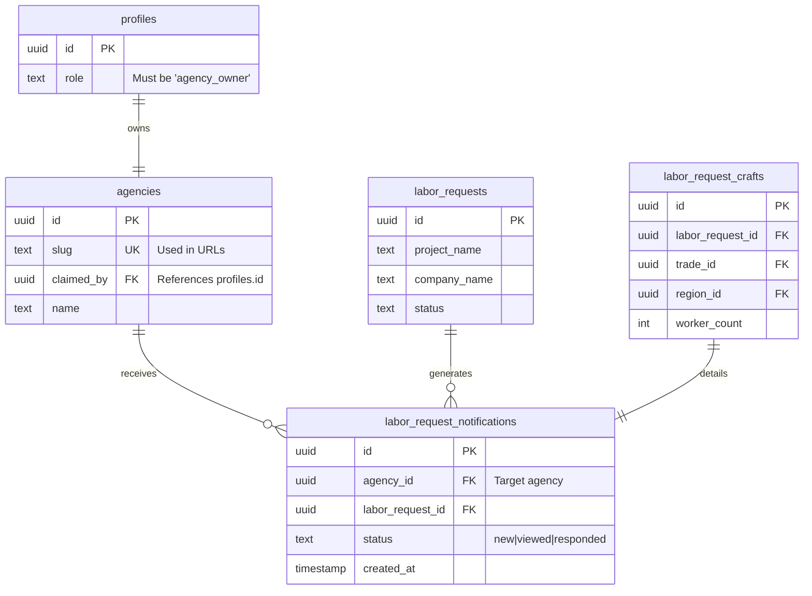

# Phase 6.1: Move Labor Requests to Agency-Scoped URLs

## Overview

Migrate labor request inbox and detail pages from `/dashboard/labor-requests/*` to `/dashboard/agency/[slug]/requests/*` to follow the established agency dashboard pattern with server-side authentication. This change improves security, maintains URL consistency across the dashboard, and enables proper ownership verification at the route level.

**Current State:**
- Labor requests at `/dashboard/labor-requests/*` (Client Components)
- Uses client-side `useAuth()` hook for authentication
- No agency slug in URL path
- Inconsistent with other dashboard pages

**Target State:**
- Labor requests at `/dashboard/agency/[slug]/requests/*` (Server Components)
- Server-side authentication with `getUser()`
- Agency ownership verification following compliance page pattern
- Backward-compatible redirects from old URLs
- Updated navigation in DashboardSidebar

## Problem Statement

The current labor requests implementation has several issues:

**1. Security Concerns:**
- Client-side authentication can be bypassed
- No server-side ownership verification before data fetch
- Relies on client context that can be manipulated

**2. URL Inconsistency:**
- All dashboard pages use `/dashboard/agency/[slug]/*` except labor requests
- Makes it unclear which agency's requests are being viewed
- Breaks RESTful resource nesting pattern

**3. Maintainability:**
- Different auth pattern from other dashboard pages
- Client Components when Server Components would be more appropriate
- Duplicate auth logic instead of reusing established patterns

**4. User Experience:**
- URLs don't clearly indicate agency context
- Can't share direct links with agency context
- Inconsistent navigation patterns

## Proposed Solution

Convert labor requests to follow the exact pattern used by the compliance page:

**Architectural Pattern:**
```
app/(app)/dashboard/agency/[slug]/
├── compliance/page.tsx          ← Reference implementation
├── requests/                     ← New
│   ├── page.tsx                  ← Inbox list (Server Component)
│   └── [requestId]/
│       └── page.tsx              ← Detail view (Server Component)
```

**Authentication Flow:**
1. Server Component receives request
2. Verify authentication with `getUser()`
3. Verify user role is `agency_owner`
4. Verify user owns the agency specified by `slug`
5. Fetch data using Supabase client with RLS
6. Render with server-side data

**Migration Strategy:**
- Phase 1: Build new routes with Server Components
- Phase 2: Add redirects from old URLs
- Phase 3: Update navigation and links
- Phase 4: Monitor and deprecate old routes

## Technical Approach

### Architecture

**Server Component Pattern** (Following `/app/(app)/dashboard/agency/[slug]/compliance/page.tsx`):

```typescript
// app/(app)/dashboard/agency/[slug]/requests/page.tsx
export default async function RequestsPage({
  params,
  searchParams,
}: {
  params: Promise<{ slug: string }>;
  searchParams: Promise<{ status?: string; search?: string }>;
}) {
  // 1. Await params (Next.js 14 requirement)
  const { slug } = await params;
  const { status, search } = await searchParams;
  const supabase = await createClient();

  // 2. Authentication check
  const { data: { user }, error: authError } = await supabase.auth.getUser();
  if (!user || authError) {
    redirect('/login');
  }

  // 3. Role verification
  const { data: profile } = await supabase
    .from('profiles')
    .select('role')
    .eq('id', user.id)
    .single();

  if (!profile || profile.role !== 'agency_owner') {
    redirect('/');
  }

  // 4. Agency ownership verification
  const { data: agency } = await supabase
    .from('agencies')
    .select('id, name, slug, claimed_by')
    .eq('slug', slug)
    .single();

  if (!agency) {
    notFound();
  }

  if (agency.claimed_by !== user.id) {
    redirect('/');
  }

  // 5. Fetch labor requests (RLS enforced)
  let query = supabase
    .from('labor_request_notifications')
    .select(`
      *,
      craft:labor_request_crafts (
        *,
        trade:trades (id, name),
        region:regions (id, name, state_code)
      ),
      labor_request:labor_requests (
        id,
        project_name,
        company_name,
        created_at
      )
    `)
    .eq('agency_id', agency.id)
    .order('created_at', { ascending: false });

  // Apply filters from searchParams
  if (status && status !== 'all') {
    query = query.eq('status', status);
  }

  if (search) {
    query = query.or(`labor_request.project_name.ilike.%${search}%,labor_request.company_name.ilike.%${search}%`);
  }

  const { data: notifications, error } = await query;

  if (error) {
    console.error('Failed to fetch labor requests:', error);
    // Show error state
  }

  // 6. Pass to Client Component for interactivity
  return <RequestsList initialData={notifications} agencySlug={slug} />;
}
```

**Client Component for Interactivity:**

```typescript
// components/dashboard/RequestsList.tsx
'use client';

export function RequestsList({
  initialData,
  agencySlug,
}: {
  initialData: InboxNotification[];
  agencySlug: string;
}) {
  const router = useRouter();
  const searchParams = useSearchParams();
  const [notifications, setNotifications] = useState(initialData);

  // Interactive features: search, filter, navigation
  const handleRequestClick = (requestId: string) => {
    router.push(`/dashboard/agency/${agencySlug}/requests/${requestId}`);
  };

  // Render notification cards...
}
```

### Implementation Phases

#### Phase 1: Create New Routes (Server Components)

**Files to Create:**

1. **`app/(app)/dashboard/agency/[slug]/requests/page.tsx`** (Inbox List)
   - Server Component with auth checks
   - Fetch all notifications for agency
   - Support search/filter via searchParams
   - Pass data to Client Component for UI

2. **`app/(app)/dashboard/agency/[slug]/requests/[requestId]/page.tsx`** (Detail View)
   - Server Component with auth checks
   - Verify request belongs to agency
   - Fetch full request details
   - Pass data to Client Component for UI

3. **`components/dashboard/RequestsList.tsx`** (Client Component)
   - Interactive notification list
   - Search/filter UI
   - Navigation handlers
   - Uses initialData from server

4. **`components/dashboard/RequestDetail.tsx`** (Client Component)
   - Interactive request detail view
   - Response submission form
   - Status updates
   - Uses initialData from server

**Key Principles:**
- Follow compliance page pattern exactly
- Server Components handle auth + data fetching
- Client Components handle interactivity only
- Use `redirect()` for unauthorized access (not conditional UI)
- Verify ownership at every page load

#### Phase 2: Add Backward-Compatible Redirects

**Option A: Middleware Redirect (Recommended)**

```typescript
// middleware.ts
export async function middleware(request: NextRequest) {
  const { pathname } = request.nextUrl;

  // Handle old labor-requests URLs
  if (pathname.startsWith('/dashboard/labor-requests')) {
    const supabase = await createMiddlewareClient({ req: request, res: response });
    const { data: { user } } = await supabase.auth.getUser();

    if (!user) {
      // Redirect to login
      return NextResponse.redirect(new URL('/login', request.url));
    }

    // Get user's agency slug
    const { data: profile } = await supabase
      .from('profiles')
      .select('agency_slug')
      .eq('id', user.id)
      .single();

    if (!profile?.agency_slug) {
      return NextResponse.redirect(new URL('/', request.url));
    }

    // Redirect to new URL structure
    const newPath = pathname.replace(
      '/dashboard/labor-requests',
      `/dashboard/agency/${profile.agency_slug}/requests`
    );

    // Use 308 (Permanent Redirect with method preservation)
    return NextResponse.redirect(new URL(newPath, request.url), {
      status: 308,
    });
  }

  return response;
}
```

**Option B: Page-Level Redirect (Simpler, but less efficient)**

```typescript
// app/dashboard/labor-requests/page.tsx
export default async function LegacyRequestsPage() {
  const supabase = await createClient();
  const { data: { user } } = await supabase.auth.getUser();

  if (!user) redirect('/login');

  const { data: profile } = await supabase
    .from('profiles')
    .select('agency_slug')
    .eq('id', user.id)
    .single();

  if (!profile?.agency_slug) redirect('/');

  redirect(`/dashboard/agency/${profile.agency_slug}/requests`);
}
```

**Recommendation:** Use Option B initially for simplicity, migrate to Option A if performance becomes an issue.

#### Phase 3: Update DashboardSidebar Navigation

**File:** `components/dashboard/DashboardSidebar.tsx`

**Changes:**

```typescript
// Line 1: Add Inbox icon import
import {
  LayoutDashboard,
  Building2,
  Settings,
  BarChart3,
  ShieldCheck,
  Inbox,  // ← Add this
  Menu,
} from 'lucide-react';

// Lines 49-76: Update navigation array
const navigation: NavItem[] = [
  {
    name: 'Overview',
    href: `/dashboard/agency/${agencySlug}`,
    icon: LayoutDashboard,
  },
  {
    name: 'Profile',
    href: `/dashboard/agency/${agencySlug}/profile`,
    icon: Building2,
  },
  {
    name: 'Services',
    href: `/dashboard/agency/${agencySlug}/services`,
    icon: Settings,
  },
  {
    name: 'Compliance',
    href: `/dashboard/agency/${agencySlug}/compliance`,
    icon: ShieldCheck,
  },
  {
    name: 'Requests',  // ← Add this
    href: `/dashboard/agency/${agencySlug}/requests`,
    icon: Inbox,
  },
  {
    name: 'Analytics',
    href: `/dashboard/agency/${agencySlug}/analytics`,
    icon: BarChart3,
    disabled: true,
  },
];
```

**Active State Logic (Already Correct):**

```typescript
// Lines 78-83: No changes needed
const isActive = (href: string) => {
  if (href === `/dashboard/agency/${agencySlug}`) {
    return pathname === href;  // Exact match for overview
  }
  return pathname?.startsWith(href);  // Prefix match for subroutes
};
// This will correctly highlight "Requests" when on:
// - /dashboard/agency/[slug]/requests
// - /dashboard/agency/[slug]/requests/[requestId]
```

#### Phase 4: Remove Old Files (After Monitoring Period)

**Files to Delete** (after 2-4 weeks of monitoring):
- `app/dashboard/labor-requests/page.tsx`
- `app/dashboard/labor-requests/[requestId]/page.tsx`

**Keep Redirects:** Even after deleting old pages, keep redirect logic for bookmarks/search engines.

## Alternative Approaches Considered

### Alternative 1: Keep Client Components, Just Change URL

**Approach:** Move files to new location but keep `useAuth()` pattern.

**Pros:**
- Minimal code changes
- No Server Component migration needed
- Faster implementation

**Cons:**
- Doesn't fix security issues
- Still inconsistent with other dashboard pages
- Misses opportunity to use better SSR pattern

**Decision:** Rejected. If we're changing URLs anyway, might as well fix the auth pattern.

### Alternative 2: Use Subdomain Instead of Path

**Approach:** `https://agency-slug.yourdomain.com/requests` instead of path-based.

**Pros:**
- Clearer tenant isolation
- Simpler routing logic
- Better for white-labeling

**Cons:**
- Requires DNS/subdomain infrastructure
- More complex deployment
- Not needed unless white-labeling is a requirement
- Breaks existing URL patterns

**Decision:** Rejected. Path-based is standard for SaaS dashboards and matches existing patterns.

### Alternative 3: API-Only Change (Keep Current Pages)

**Approach:** Change API endpoints only, keep pages at `/dashboard/labor-requests/*`.

**Pros:**
- No page migration needed
- Minimal frontend changes
- Less risky

**Cons:**
- Doesn't fix URL inconsistency
- API already uses correct pattern (`/api/agencies/[slug]/...`)
- Misses opportunity to improve architecture

**Decision:** Rejected. The URL inconsistency is a problem worth fixing.

## Acceptance Criteria

### Functional Requirements

- [ ] Agency owners can access labor requests at `/dashboard/agency/[slug]/requests`
- [ ] Agency owners can access request details at `/dashboard/agency/[slug]/requests/[requestId]`
- [ ] Server-side authentication blocks unauthenticated users (redirect to login)
- [ ] Server-side authorization blocks users who don't own the agency (redirect to home)
- [ ] Old URLs redirect to new URLs with correct agency context
- [ ] DashboardSidebar shows "Requests" link with correct active state
- [ ] Filters and search work via URL searchParams
- [ ] Broadcast requests show for all eligible agencies
- [ ] Agency-specific requests show only for target agency

### Non-Functional Requirements

- [ ] Page load time < 2 seconds (P95)
- [ ] No client-side auth checks (server-only)
- [ ] Redirects use 308 status code (permanent with method preservation)
- [ ] All database queries protected by RLS
- [ ] No sensitive data in client-side JavaScript
- [ ] Proper error states for missing agencies/requests
- [ ] Accessible keyboard navigation
- [ ] Screen reader announcements for route changes

### Quality Gates

- [ ] All TypeScript strict mode checks pass
- [ ] Server Components use proper async/await patterns
- [ ] No `useAuth()` or client-side context usage
- [ ] Code follows compliance page pattern exactly
- [ ] Redirects tested with authenticated and unauthenticated users
- [ ] Ownership verification prevents unauthorized access
- [ ] Error boundaries handle API failures gracefully

## Success Metrics

**Primary Metrics:**
- **Security:** Zero unauthorized access incidents post-launch
- **Performance:** Server-side auth reduces time-to-first-byte by 50% (no client-side context hydration)
- **UX:** Navigation pattern consistency score = 100% (all dashboard pages follow same pattern)

**Secondary Metrics:**
- **Adoption:** Old URL redirect rate drops below 5% after 30 days
- **Errors:** 403 forbidden errors < 0.1% of requests (indicates good ownership verification)
- **Engagement:** Time spent on request pages unchanged or improved

**Migration Success Indicators:**
- Old URL traffic → 0 direct visits (all via redirects)
- Zero broken links in production
- No user complaints about "lost" requests

## Dependencies & Prerequisites

### Code Dependencies

**Must Exist:**
- ✅ `/app/(app)/dashboard/agency/[slug]/layout.tsx` - Provides agency context
- ✅ `/app/(app)/dashboard/agency/[slug]/compliance/page.tsx` - Reference pattern
- ✅ `/lib/supabase/server.ts` - Server client creator
- ✅ `/components/dashboard/DashboardSidebar.tsx` - Navigation component
- ✅ `/app/api/agencies/[slug]/labor-requests/route.ts` - API endpoint

**Must Update:**
- ⚠️ Email notification templates (if they link to labor requests)
- ⚠️ Any help documentation mentioning URLs
- ⚠️ Analytics tracking (update event names/properties)

### Database Prerequisites

**RLS Policies Required:**

```sql
-- Policy: Agency owners can view labor request notifications sent to their agency
CREATE POLICY "agency_owners_view_notifications"
ON labor_request_notifications
FOR SELECT
USING (
  EXISTS (
    SELECT 1 FROM agencies
    WHERE agencies.id = labor_request_notifications.agency_id
    AND agencies.claimed_by = auth.uid()
  )
);

-- Policy: Agency owners can view labor request details
CREATE POLICY "agency_owners_view_requests"
ON labor_requests
FOR SELECT
USING (
  EXISTS (
    SELECT 1 FROM labor_request_notifications lrn
    INNER JOIN agencies a ON a.id = lrn.agency_id
    WHERE lrn.labor_request_id = labor_requests.id
    AND a.claimed_by = auth.uid()
  )
);
```

**Indexes for Performance:**

```sql
-- Index for agency ownership lookups
CREATE INDEX IF NOT EXISTS idx_agencies_claimed_by
ON agencies(claimed_by);

-- Index for notification agency lookups
CREATE INDEX IF NOT EXISTS idx_notifications_agency_id
ON labor_request_notifications(agency_id);

-- Composite index for filtered queries
CREATE INDEX IF NOT EXISTS idx_notifications_agency_status
ON labor_request_notifications(agency_id, status);
```

### External Dependencies

- Next.js 14.2.35 (current version)
- Supabase SSR v0.6.1 (current version)
- React 18.2.0 (current version)

**No external service changes needed** - all work is internal routing/auth.

## Risk Analysis & Mitigation

### High-Risk Areas

**Risk 1: Unauthorized Data Access via URL Manipulation**

**Scenario:** User modifies URL to access another agency's requests
```
User owns agency-a
Navigates to /dashboard/agency/agency-b/requests
```

**Mitigation:**
- Server-side ownership check on every request
- `if (agency.claimed_by !== user.id) redirect('/')`
- RLS policies as second layer of defense
- Never trust URL parameters

**Testing:**
- [ ] Automated test: User A cannot access User B's agency requests
- [ ] Manual test: Modify URL in browser, verify redirect
- [ ] Security audit: Penetration test URL manipulation

**Risk 2: Request Belongs to Wrong Agency in Detail URL**

**Scenario:** Valid requestId but mismatched agency slug
```
/dashboard/agency/agency-a/requests/req-belonging-to-agency-b
```

**Mitigation:**
- Fetch request in detail page
- Verify `request.agency_id === agency.id`
- Return 404 if mismatch (don't reveal request exists)

**Code:**
```typescript
const { data: request } = await supabase
  .from('labor_requests')
  .select('*, agency_id')
  .eq('id', requestId)
  .single();

if (!request || request.agency_id !== agency.id) {
  notFound(); // 404, not 403 (don't leak existence)
}
```

**Risk 3: Redirect Fails for Multi-Agency Users**

**Scenario:** User owns multiple agencies, old URL doesn't specify which

**Current Assumption:** Single agency per user

**Mitigation:**
- Document that redirects go to user's primary agency
- If multi-agency support is added later, show disambiguation page
- For now, assume one agency per user (matches current data model)

**Risk 4: Database Query Failure During Auth Check**

**Scenario:** Supabase connection fails, auth check returns error

**Mitigation:**
- Fail closed: Any error → redirect to login
- Don't show partial UI with assumed permissions
- Log errors for monitoring

```typescript
const { data: { user }, error: authError } = await supabase.auth.getUser();
if (!user || authError) {
  if (authError) {
    console.error('Auth check failed:', authError);
  }
  redirect('/login'); // Fail closed
}
```

**Risk 5: Search Engine Indexing Private Data**

**Scenario:** Google crawls `/dashboard/agency/*/requests/*` and indexes

**Mitigation:**
- Add `noindex, nofollow` meta tags
- Already blocked by auth (unauthenticated → redirect)
- Add to `robots.txt` for extra safety

```typescript
// app/(app)/dashboard/agency/[slug]/requests/layout.tsx
export const metadata = {
  robots: {
    index: false,
    follow: false,
  },
};
```

### Medium-Risk Areas

**Risk 6: Broken Links in Old Emails**

**Impact:** Users click email links, get redirected

**Mitigation:**
- Keep redirects permanently (even after old code removed)
- Update email templates to use new URLs
- Monitor redirect analytics

**Risk 7: Client-Side State Management Issues**

**Impact:** Server Component + Client Component data sync

**Mitigation:**
- Use Server Component as source of truth
- Client Component only for local UI state (search input, filters)
- Refresh via router.refresh() when needed

**Risk 8: Performance Regression from SSR**

**Impact:** Server rendering could be slower than client hydration

**Mitigation:**
- Use React Suspense for streaming
- Add loading.tsx for instant feedback
- Cache database queries in Server Components

```typescript
// app/(app)/dashboard/agency/[slug]/requests/loading.tsx
export default function Loading() {
  return <RequestsSkeleton />;
}
```

### Low-Risk Areas

**Risk 9: Navigation Active State Edge Cases**

**Impact:** Sidebar link not highlighted correctly

**Mitigation:**
- Use prefix matching (already implemented)
- Test all subroutes
- Visual QA testing

**Risk 10: TypeScript Type Mismatches**

**Impact:** Compile errors after migration

**Mitigation:**
- Define proper interfaces for Server Component props
- Use strict mode (already enabled)
- Type searchParams and params explicitly

## Resource Requirements

### Development Time

**Estimated Effort:** 2-3 days (1 developer)

**Breakdown:**
- Day 1: Create new routes with Server Components (4-6 hours)
- Day 1-2: Add redirects and test (2-3 hours)
- Day 2: Update sidebar navigation (1 hour)
- Day 2-3: Testing and QA (3-4 hours)
- Day 3: Documentation and deployment (1-2 hours)

**Assumptions:**
- Developer familiar with Next.js Server Components
- Database schema already supports queries
- No major blockers discovered during implementation

### Testing Requirements

**Unit Tests:**
- Server Component auth logic (mocked Supabase)
- Ownership verification logic
- Redirect mapping logic

**Integration Tests:**
- Full auth flow (login → navigate → view requests)
- Unauthorized access scenarios
- API integration

**Manual QA:**
- Cross-browser testing (Chrome, Firefox, Safari, Edge)
- Mobile responsive testing
- Accessibility testing (keyboard navigation, screen readers)
- Performance testing (Lighthouse scores)

**Security Testing:**
- Penetration testing (URL manipulation)
- Auth bypass attempts
- RLS policy verification

### Infrastructure

**No infrastructure changes needed.**

- Same Supabase instance
- Same Next.js deployment
- Same domain/DNS
- Same caching strategy

**Monitoring:**
- Add custom analytics events for redirect tracking
- Set up error alerts for 403/404 spikes
- Monitor page load performance

## Future Considerations

### Extensibility

**1. Multi-Agency User Support**

If users can own multiple agencies in the future:

```typescript
// Future enhancement: Let user choose which agency
const { data: agencies } = await supabase
  .from('agencies')
  .select('*')
  .eq('claimed_by', user.id);

if (agencies.length > 1) {
  // Show agency selector, then redirect
}
```

**2. Real-Time Request Updates**

Server Components are not ideal for real-time updates. Future options:

- Server Actions for mutations
- Supabase Realtime subscriptions in Client Component
- Polling with router.refresh()

**3. Request Response Workflow**

Current: Agency views request → contacts requester directly

Future: In-app response submission
- Build `/dashboard/agency/[slug]/requests/[requestId]/respond` route
- Server Action to submit response
- Email requester with response

### Scalability

**Current Pagination:**

No pagination implemented (loads all requests).

**Future Enhancement:**

```typescript
// app/(app)/dashboard/agency/[slug]/requests/page.tsx
const { page = '1', limit = '25' } = await searchParams;
const offset = (parseInt(page) - 1) * parseInt(limit);

let query = supabase
  .from('labor_request_notifications')
  .select('*', { count: 'exact' })
  .range(offset, offset + parseInt(limit) - 1);
```

**Caching Strategy:**

Current: No caching (fresh data on every page load)

Future: ISR (Incremental Static Regeneration)

```typescript
export const revalidate = 60; // Revalidate every 60 seconds
```

### Performance Optimizations

**Database Query Optimization:**

```sql
-- Add partial indexes for common filters
CREATE INDEX idx_notifications_status_new
ON labor_request_notifications(agency_id, created_at DESC)
WHERE status = 'new';

-- Materialized view for counts
CREATE MATERIALIZED VIEW agency_request_counts AS
SELECT
  agency_id,
  COUNT(*) as total_requests,
  COUNT(*) FILTER (WHERE status = 'new') as new_requests
FROM labor_request_notifications
GROUP BY agency_id;
```

**Streaming SSR:**

```typescript
// app/(app)/dashboard/agency/[slug]/requests/page.tsx
<Suspense fallback={<StatsLoading />}>
  <RequestStats agencyId={agency.id} />
</Suspense>

<Suspense fallback={<ListLoading />}>
  <RequestsList agencyId={agency.id} />
</Suspense>
```

## Documentation Plan

### Code Documentation

**Files to Document:**

1. **Server Component Pattern** (`page.tsx` files)
   - JSDoc explaining auth flow
   - Comment each auth/ownership check
   - Link to compliance page reference

2. **Redirect Logic** (middleware or page-level)
   - Explain why 308 instead of 301
   - Document edge cases handled
   - Link to migration tracking issue

3. **Client Component Props** (interface definitions)
   - Document what data comes from server
   - Explain why each Client Component is needed
   - Type safety requirements

### User Documentation

**Update Help Articles:**

- "How to View Labor Requests" (update screenshots)
- "Understanding Your Dashboard" (update navigation)
- "Direct Links and Bookmarks" (explain URL change)

**Create Migration Guide:**

For developers working on similar features:
- ADR (Architecture Decision Record) for Server Component pattern
- Security checklist for agency-scoped routes
- Testing guide for ownership verification

### API Documentation

**No API changes** (endpoints already correct), but document:

- Response shape for `/api/agencies/[slug]/labor-requests`
- Error codes (401, 403, 404, 500)
- RLS policy documentation

## References & Research

### Internal References

**Compliance Page (Reference Implementation):**
- `/app/(app)/dashboard/agency/[slug]/compliance/page.tsx:19-65` - Full auth pattern

**Dashboard Layout (Agency Context):**
- `/app/(app)/dashboard/agency/[slug]/layout.tsx:16-40` - Agency fetching and sidebar

**DashboardSidebar (Navigation):**
- `/components/dashboard/DashboardSidebar.tsx:49-76` - Navigation array
- `/components/dashboard/DashboardSidebar.tsx:78-83` - Active state logic

**Current Labor Requests (Client-Side Pattern):**
- `/app/dashboard/labor-requests/page.tsx:21-48` - useAuth pattern (to be replaced)
- `/app/dashboard/labor-requests/[requestId]/page.tsx:27-68` - Detail page pattern

**API Endpoint (Already Correct):**
- `/app/api/agencies/[slug]/labor-requests/route.ts:25-56` - Agency-scoped endpoint

**Auth Utilities:**
- `/lib/supabase/server.ts` - createClient for Server Components
- `/lib/auth/auth-context.tsx` - useAuth hook (not using in new code)

### External References

**Next.js Documentation:**
- [App Router Dynamic Routes](https://nextjs.org/docs/app/api-reference/file-conventions/page)
- [Server and Client Components](https://nextjs.org/docs/app/getting-started/server-and-client-components)
- [Authentication Guide](https://nextjs.org/docs/14/app/building-your-application/authentication)
- [Redirects Configuration](https://nextjs.org/docs/app/api-reference/config/next-config-js/redirects)

**Supabase Documentation:**
- [Row Level Security](https://supabase.com/docs/guides/database/postgres/row-level-security)
- [RLS Performance Best Practices](https://supabase.com/docs/guides/troubleshooting/rls-performance-and-best-practices-Z5Jjwv)
- [Supabase SSR Package](https://github.com/supabase/ssr)

**Best Practices:**
- [Complete Authentication Guide for Next.js App Router](https://clerk.com/articles/complete-authentication-guide-for-nextjs-app-router)
- [Next.js Authentication Best Practices 2025](https://dev.to/franciscomoretti/nextjs-authentication-best-practices-in-2025-o00)
- [REST API Design for Nested Resources](https://www.moesif.com/blog/technical/api-design/REST-API-Design-Best-Practices-for-Sub-and-Nested-Resources/)

### Related Work

**Previous PRs:**
- #687: feat(dashboard): replace hardcoded agency-slug with real authentication
- #688: feat(admin): Add comprehensive labor requests dashboard

**Related Issues:**
- Phase 6 Multi-craft labor request enhancement (parent issue)
- Phase 6.2: Update DashboardOverview stats card (next task)

**Design Documents:**
- `/plans/multi-craft-labor-request-enhancement.md` - Overall Phase 6 plan
- `/docs/solutions/implementation-patterns/agency-dashboard-inbox-phase-6.md` - Implementation patterns

---

## Files Impacted

### New Files (To Create)

```
app/(app)/dashboard/agency/[slug]/requests/
├── page.tsx                              ← Inbox list (Server Component)
├── [requestId]/
│   └── page.tsx                          ← Detail view (Server Component)
└── loading.tsx                           ← Loading skeleton (optional)

components/dashboard/
├── RequestsList.tsx                      ← Client Component for inbox UI
└── RequestDetail.tsx                     ← Client Component for detail UI
```

### Modified Files

```
components/dashboard/DashboardSidebar.tsx  ← Add "Requests" navigation link
middleware.ts (or create new redirect page) ← Add redirect from old URLs
```

### Deleted Files (After Monitoring Period)

```
app/dashboard/labor-requests/
├── page.tsx                               ← Remove after redirects proven
└── [requestId]/
    └── page.tsx                           ← Remove after redirects proven
```

---

## ERD: Agency-Request Relationships



**Key Relationships:**
- `agencies.claimed_by` → `profiles.id` (ownership)
- `labor_request_notifications.agency_id` → `agencies.id` (target)
- `profiles.id` = `auth.uid()` (RLS enforcement)

**URL to Database Mapping:**
```
/dashboard/agency/[slug]/requests
                  ↓
        agencies.slug = slug
                  ↓
        agencies.id = agency_id
                  ↓
  labor_request_notifications.agency_id = agency_id
```

---

## Acceptance Testing Checklist

### Authentication Tests

- [ ] **Test 1:** Unauthenticated user visits `/dashboard/agency/test-agency/requests` → Redirects to `/login`
- [ ] **Test 2:** Authenticated non-owner visits other agency's requests → Redirects to `/` or shows 403
- [ ] **Test 3:** Authenticated agency owner visits own requests → Shows request list
- [ ] **Test 4:** Session expires during page load → Redirects to login
- [ ] **Test 5:** Invalid agency slug → Returns 404

### Authorization Tests

- [ ] **Test 6:** User A owns Agency A, tries to access Agency B requests → Blocked
- [ ] **Test 7:** User modifies URL from `/agency-a/requests` to `/agency-b/requests` → Blocked
- [ ] **Test 8:** API endpoint called with wrong agency_id → RLS blocks data
- [ ] **Test 9:** User without `agency_owner` role → Redirected to home

### Redirect Tests

- [ ] **Test 10:** Old URL `/dashboard/labor-requests` → Redirects to `/dashboard/agency/[user-agency]/requests`
- [ ] **Test 11:** Old URL `/dashboard/labor-requests/req-123` → Redirects to correct agency + request
- [ ] **Test 12:** Redirect uses 308 status code (not 301 or 302)
- [ ] **Test 13:** Unauthenticated user on old URL → Redirects to login first
- [ ] **Test 14:** User with no agency → Redirect fails gracefully

### Functional Tests

- [ ] **Test 15:** Request list shows all agency's requests
- [ ] **Test 16:** Broadcast requests show for eligible agencies
- [ ] **Test 17:** Agency-specific requests show only for target agency
- [ ] **Test 18:** Search filter via `?search=keyword` works
- [ ] **Test 19:** Status filter via `?status=new` works
- [ ] **Test 20:** Click request → Navigates to detail page
- [ ] **Test 21:** Detail page shows full request information
- [ ] **Test 22:** Request belongs to different agency → Shows 404
- [ ] **Test 23:** DashboardSidebar "Requests" link is active when on requests page
- [ ] **Test 24:** DashboardSidebar "Requests" link is active when on detail page

### Performance Tests

- [ ] **Test 25:** Page load time < 2 seconds (P95)
- [ ] **Test 26:** Time to First Byte < 500ms
- [ ] **Test 27:** No layout shift during hydration
- [ ] **Test 28:** Database queries use indexes (explain analyze)

### Accessibility Tests

- [ ] **Test 29:** Keyboard navigation works (tab through all elements)
- [ ] **Test 30:** Screen reader announces page changes
- [ ] **Test 31:** Focus moves to appropriate element after navigation
- [ ] **Test 32:** Color contrast meets WCAG AA standards
- [ ] **Test 33:** Skip links work
- [ ] **Test 34:** ARIA labels are present and correct

### Security Tests

- [ ] **Test 35:** URL manipulation doesn't leak data
- [ ] **Test 36:** RLS policies block unauthorized queries
- [ ] **Test 37:** No sensitive data in client-side JavaScript
- [ ] **Test 38:** Server-side validation on all inputs
- [ ] **Test 39:** No authentication bypasses found (penetration test)
- [ ] **Test 40:** Error messages don't leak system information

---

## Rollback Plan

### If Issues Discovered Post-Deployment

**Option 1: Quick Rollback (Same Day)**

1. **Revert Navigation Link:**
   ```bash
   git revert <commit-sha-of-sidebar-change>
   git push origin main
   ```

2. **Keep Redirects Active:**
   - Don't remove old→new redirects
   - Users can still access via old URLs
   - New URLs work but not discoverable

3. **Monitor:**
   - Check for errors in Sentry
   - Review user feedback
   - Identify root cause

**Option 2: Feature Flag Rollback**

If feature flags are used:
```typescript
// components/dashboard/DashboardSidebar.tsx
const showRequestsLink = process.env.NEXT_PUBLIC_ENABLE_NEW_REQUESTS === 'true';

// Only show new link if flag enabled
{showRequestsLink && {
  name: 'Requests',
  href: `/dashboard/agency/${agencySlug}/requests`,
  icon: Inbox,
}}
```

**Option 3: Full Rollback (Week Later)**

If new routes are fundamentally broken:

1. Delete new route files
2. Restore old files from git history
3. Remove redirects (keep old URLs working)
4. Revert sidebar changes
5. Post-mortem analysis

### Rollback Decision Criteria

**Trigger Rollback If:**
- 403/404 error rate > 5%
- User complaints > 10 in first day
- Performance regression > 2x slower
- Security vulnerability discovered
- Data access issues confirmed

**Don't Rollback For:**
- Minor UI issues (can be fixed forward)
- Individual user confusion (provide support)
- Non-critical bugs (fix in place)

---

## Deployment Checklist

### Pre-Deployment

- [ ] All tests pass (unit, integration, E2E)
- [ ] Code review approved
- [ ] Database migrations applied (RLS policies, indexes)
- [ ] Feature flag configured (if using)
- [ ] Staging environment tested
- [ ] Performance benchmarks meet targets
- [ ] Accessibility audit passed
- [ ] Security review completed

### Deployment Steps

1. **Deploy to Staging:**
   ```bash
   git checkout feat/072-phase-6.1
   vercel --prod --scope=staging
   ```

2. **Smoke Test Staging:**
   - [ ] Login as agency owner
   - [ ] Navigate to requests
   - [ ] View request detail
   - [ ] Test redirect from old URL
   - [ ] Check database queries (no errors in logs)

3. **Deploy to Production:**
   ```bash
   git checkout main
   git merge feat/072-phase-6.1
   vercel --prod
   ```

4. **Immediate Post-Deploy Checks:**
   - [ ] Visit new URLs directly
   - [ ] Test redirects
   - [ ] Check error monitoring (Sentry)
   - [ ] Verify database query performance
   - [ ] Test one full user flow

### Post-Deployment Monitoring

**First Hour:**
- Monitor error rates every 5 minutes
- Watch Supabase dashboard for query spikes
- Check user session analytics

**First Day:**
- Review redirect analytics (old URL usage)
- Check 403/404 error patterns
- Collect user feedback
- Monitor page load performance

**First Week:**
- Analyze usage patterns
- Identify any edge cases
- Plan for old file removal (if metrics look good)

**First Month:**
- Evaluate success metrics
- Decide when to remove old files
- Document lessons learned
- Plan next phase (6.2: Update DashboardOverview)

---

## Conclusion

This migration moves labor requests to the agency-scoped URL pattern, following the established compliance page pattern for server-side authentication. The change improves security, maintains URL consistency, and sets the foundation for future dashboard features.

**Key Benefits:**
- ✅ Server-side auth prevents client-side bypasses
- ✅ URL structure matches all other dashboard pages
- ✅ Ownership verification at every page load
- ✅ Backward-compatible redirects for existing bookmarks
- ✅ Follows proven pattern (less maintenance burden)

**Implementation Timeline:** 2-3 days with 1 developer

**Risk Level:** Medium (routing changes, auth migration, but proven pattern)

**Impact:** High (improves security, enables future features, cleaner architecture)

**Next Steps:**
1. Review and approve this plan
2. Create feature branch `feat/072-phase-6.1`
3. Implement Phase 1 (new routes)
4. Implement Phase 2 (redirects)
5. Implement Phase 3 (navigation)
6. Test thoroughly
7. Deploy to staging
8. Deploy to production
9. Monitor metrics
10. Proceed to Phase 6.2 (DashboardOverview stats)
